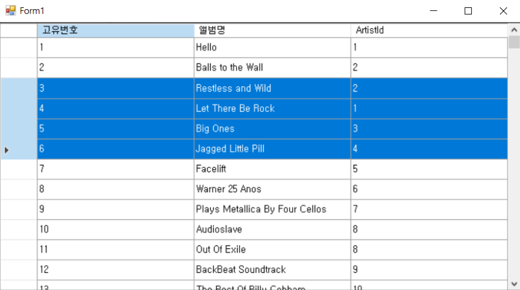
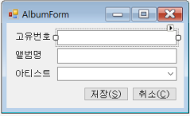

# 가상함수 OnLoad

- 폼이 로드 될 떄 EF 데이터를 가져오려고 할 떄, Load 이벤트 핸들러를 사용해 작업할 수도 있지만, Form 클래스 내부에서 제공하는 가상함수 OnLoad를 사용하면 된다
- 이벤트 핸들러를 사용하지 않아 코드가 간결해지고. OnLoad를 사용하면 실제 로드가 진행되는 시점을 제어하여 로드 전에 작업이 이루어지도록 할 수도 있다.

```csharp
protected override void OnLoad(EventArgs e)
{
	base.OnLoad(e);
	int count = Dao.Album.GetCount();
	MessageBox.Show(count.ToString());
}
```

# 데이터베이스 바인딩(데이터 그리드 뷰)

- 데이터 그리드 뷰를 선택하고 데이터 소스 추가를 선택하여 데이터 개체를 선택, 원하는 EF 테이블 개체를 선택해준다. 그러면 해당 개체에 대한 바인딩 리소스가 생성된다.
- 열 편집을 하여 필요없는 열은 제거하거나, 속성을 수정할 수도 있다.
- 생성된 바인딩소스는 그대로 사용하면 아무 값이 없다. 그래서 OnLoad에서 바인딩소스에 데이터를 넣어줘야 한다.
- 데이터를 입력한 후에 프로그램을 실행하면 그리드 뷰를 통해 테이블 값이 출력된다. 지금 상황에서는 그리드 뷰에서 수정을 한다고 DB에 적용되지 않는다. 물론 그리드에서 바로 수정하는 것은 권장하지 않는다. 그리드의 ReadOnly 속성을 True로 설정해주면 수정이 안되도록 할 수 있다.

```csharp
protected override void OnLoad(EventArgs e)
{
	base.OnLoad(e);
	albumBindingSource.DataSource = Dao.Album.GetAll();
}
```

# 그리드 뷰 선택 옵션

- SelectMode를 선택하면, 데이터 하나를 선택할지 행 단위로 선택할지 정할 수 있다.



- SelectedRow(s)는 파란색으로 칠해진 영역 전체를 의미하고. Current(FocusedRow)는 좌측에 화살표로 선택되어 있는 행을 의미한다.

# 연결된 테이블의 값 가져오기

- Album 테이블의 ArtistId값이 있는데, 사용자에게는 Artist의 Name을 보여주는 것이 좋을 것 같다. 하지만 Artist의 Name은 Artist 테이블에 있다.
- 그래서 Album 클래스에 프로퍼티를 추가하여 데이터를 받아보려고 하는데, EF가 생성한 entity 클래스 파일은 자동 생성 파일이기 때문에, 수정을 하면 안된다. 그래서 추가로 파일을 만들고 분할 클래스로 추가하고자 하는 맴버를 추가해준다

```csharp
public partial class Album{
	public string ArtistName{ get; internal set; }
}
```

- 이후, DAO클래스에 다른테이블의 값을 같이 가져오는 메서드를 만들어준다

```csharp
public List<Album> GetWithArtistName()
{
	using(var context = new ChinookEntities())
	{
		//Dictionary<int, string> names = context.Artists.
		//ToDictionary(x => x.ArtistId, x => Name);
		//var query = from x in context.Albums select x;
		//List<Album> album = query.ToList();

		// EF가 생성한 entity에는 연결된 관계에 따른 데이터도
		// 받을 수 있게 되어 있다. 그래서 Album 클래스에서
		// Artist 클래스를 연결할 수 있다.
		// x.Artist.Name
		var query = from x in context.Albums select
			new{Album = x, ArtstName = x.Artist.Name};
		var list = query.ToList();
		
		//foreach(var album in albums)
		//{
		//	album.ArtistName = names[album.ArtistId];
		//}
		foreach(var item in list)
		{
			item.Album.ArtistName = item.ArtistName;
		}
		
		//return album;
		return list.ConvertAll(x => x.Album);
		//return list.Select(x => x.Album).ToList();
	}
}
```

# 검색 조건 만들기

- 그리드뷰에 표시되는 테이블 중에 원하는 조건의 값만 출력하도록 하고 싶다
- 그래서 검색 조건을 작성할 텍스트박스와 버튼 컨트롤을 추가한다.
- 그리고 검색 조건에 따라 원하는 행을 불러오도록 DAO클래스에 만들었던 쿼리값을 가져오는 메서드를 수정한 메서드를 만든다.

```csharp
public List<Album> GetWithArtistNameEx(int? maxAlbumId, string albumName, string artistName)
{
	using(var context = new ChinookEntities())
	{
		var query = from x in context.Albums select
			new{Album = x, ArtstName = x.Artist.Name};

		// 특정 번호 까지 AlbumId
		if(maxAlbumId.HasVaule)
			query = query.Where(x => x.Album.AlbumId <= maxAlbumId);

		// 특정 문자 포함 AlbumName
		if(string.IsNullOrEmpty(albumName) == false)
			query = query.Where(x => x.Album.Name.Contains(albumName));

		// 특정 문자 포함 ArtistName
		if(string.IsNullOrEmpty(artistName) == false)
			query = query.Where(x => x.ArtistName.Contains(artistName));

		var list = query.ToList();
		
		foreach(var item in list)
		{
			item.Album.ArtistName = item.ArtistName;
		}
		
		return list.ConvertAll(x => x.Album);
	}
}
```

- 그 다음, 버튼을 클릭할 시 입력한 조건에 맞게 데이터를 다시 불러오도록 한다

```csharp
private void btnSearch_Click(object sender, EventArgs e)
{
	int? albumId = ParseAlbumId();
	List<Album> list = Dao.Album.GetWithArtistNameEx
		(albumId, txbAlbumName.Text, txbArtistName.Text);
	bdsAlbum.DataSource = list;
}

private int? ParseAlbumId()
{
	int albumId;
	bool parsed = int.TryParse(txbAlbumId.Text, out albumId);
	return parsed ? albumId : (int?)null;
}
```

# 예외처리

- 텍스트 박스에 원하지 않은 값이 입력될 경우 검색이 안되도록 하려고 한다. 예를 들어 ID값을 입력해야 하는데 문자가 입력되거나, 아무 값도 입력되어 있지 않을 수 있다.
- 이를 위해서는, 텍스트 박스에 값이 입력될 때 마다 검사를 하는 구문을 만들면 된다.

```csharp
private void txbAlbumId_KeyUp(object sender, EventArgs e)
{
	// string.Empty : ""과 유사한 의미이지만 기능적으로 더 좋다
	bool parsable = txbAlbumId.Text == string.Empty || ParseAlbumId() != null;
	// Enabled : bool값으로 컨트롤을 활성화시킨다.
	btnSearch.Enabled = parsable;
}
```

# 상세정보

- 앨범의 열을 더블클릭으로 선택하면 앨범의 상세 정보를 볼 수 있는 창이 뜨면 좋을 것 같다.
- 새로운 창을 만들기 위해 새로운 폼을 만들어 주고, 데이터가 출력되도록 텍스트 박스를 넣어준다.
- 아티스트 정보는 특별히 콤보 박스로 만들었다.
- 콤보 박스는 데이터 바인딩 모드로 Artist를 불러와 artistBindingSource를 만들고, 맴버 표시는 Name으로 하고 값 맴버는 ArtistId로 지정한다

<center></img></center>

- 리스트가 있는 폼으로부터 값을 읽고, 그 값을 수정하는 코드를 작성한다.

```csharp
private Album _album;
public AlbumForm(Album album) : this()
{
	_album = album;
}

private void ReadFromEntity()
{
	txbAlbumId.Text = _album.AlbumId.ToString();
	txbName.Text = _album.Name;
	cbbArtistId.SelectedValue = _album.ArtistId;
}
protected override void OnLoad(EventArgs e)
{
	base.OnLoad(e);
	// artistBindingSource에 값을 넣어준다
	bdsArtist.DataSource = Dao.Artist.GetAll();
	// 입력받은 값을 출력해준다
	ReadFromEntity();
}

private void WriteToEntity()
{
	_album.Name = txbName.Text;
	_album.ArtistId = (int)cbbArtistId.SelectedValue;
}
private void btnSave_Click(object sender, EventArgs e)
{
	// 콤보박스, 텍스트박스에 수정된 값을 입력해준다
	writeToEntity();
	// Update를 진행한다
	Dao.Album.Update(_album);

	DialogResult = DialogResult.OK;
	Close();
}
```

- 수정 말고 추가나 제거를 하고 싶다면 어떨까? 특수키를 이용해 추가, 삭제 형태도 구현해보자

```csharp
// Insert - AlbumListForm
Album album = new Album();
AlbumForm from = new AlbumForm(album);
form.ShowDialog();

// Insert - AlbumForm
private void btnSave_Click(object sender, EventArgs e)
{
	writeToEntity();
	// 새로 생성된 데이터는 ID값이 기본값이라는 점을 이용했다
	if(_album.AlbumId == 0)
		Dao.Album.Insert(_album);
	else	
		Dao.Album.Update(_album);

	DialogResult = DialogResult.OK;
	Close();
}

// Delete
Album album = bdsAlbum.Current as Album;
if(album == null)
	return;
Dao.Album.DeleteByPK(album.AlbumId);
```

# 유틸리티 클래스

- 추가나 삭제시 확인 메시지(MessageBox) 출력 같이 자주 쓰이는 내용들이 있는데, 이런 부분은 상수 클래스처럼 따로 클래스로 분류하여 사용하는 것이 좋다. 클래스는 static으로 구성할것이다.

```csharp
public static class WinformUtility
{
	public static bool AskSure(string question)
	{
		MessageBox.Show(question, "질문",
			MessageBoxButtons.YesNo, MessageBoxIcon.Question,
			MessageBoxDefaultButton.Button2);
	}
}
```

# 사용자 정의 컨트롤

- 폼에 여러 기능을 구현하면서 코드의 규모가 커졌다. 이를 정리하면서 별개의 클래스로 뺴내면 좋을 것 같은데, 이 떄 사용할 수 있는 기능이 사용자 정의 컨트롤이다.
- 새 항목 추가에서 '사용자 정의 컨트롤(User Control)'을 선택하여 생성한다. 참고로 '사용자 지정 컨트롤(Custom Control)'은 다른 기능으로, 거의 사용하지 않는다.
- 사용자 정의 컨트롤을 생성하고 사용하고자 하는 컨트롤을 생성하거나, 다른 폼에서 가져오자. 지금은 리스트 폼에서 만들어두었던 검색에 사용하는 텍스트박스와 버튼을 가져왔다.
- 컨트롤을 구성한 뒤에는 폼 클래스 처럼 똑같이 코드를 수정하고, 이벤트 핸들러를 등록할 수 있다.
- 이렇게 만든 사용자 정의 컨트롤을 도구 상자의 구성 요소에서 가져다 사용할 수 있다.
- 하지만 문제가 되는 것은, 사용자 정의 컨트롤에서 만든 이벤트 핸들러는 사용저 정의 컨트롤 내에서 실행되는 이벤트에 해당한다는 것이다. 그래서 폼과 등록된 사용자 정의 컨트롤 사이에 통신이 되야 한다.

## 1. 프로퍼티를 만든다

- 가장 단순한 방법은, 사용자 정의 컨트롤에 접근 가능한 프로퍼티를 만들어 두면, 폼에서 사용자 정의 컨트롤로 데이터 전달이 가능하다.
- 하지만 프로퍼티는 값만을 전달할 수 있고, 행동에 대한 전달이 힘들다.

```csharp
public string AlbumName => txbAlbumName.Text;
```

## 2. 이벤트를 만든다

- 폼에서는 사용자 정의 컨트롤에서 언제 어떤 이벤트가 일어날지 알 수 없고, 마냥 기다릴 수도 없다.
- 그래서 사용자 정의 컨트롤에 자체적으로 이벤트를 만들어, 해당 이벤트가 발생할 때 폼에서 이벤트 핸들러가 동작할 수 있도록 하면 사용자 정의 컨트롤과 폼과의 통신이 가능해진다.

```csharp
// 사용자 정의 컨트롤
// 사용자 정의 컨트롤에 이벤트를 생성한다.
public event EventHandler<SearchButtonClickedEventArgs> SearchButtonClicked;
//......
private void btnSearch_Click(object sender, EventArgs e)
{
	int? albumId = ParseAlbumId();
	OnSearchButtonClicked(albumId, txbAlbumName.Text, txbArtistName.Text);
}

// 폼
// 사용자 정의 컨트롤에서 정의된 이벤트가 발생하면 작동할 핸들러를 연결한다.
private void uscSearch_SearchButtonClicked(object sender, SearchButtonClickedEventArgs e)
{
	List<Album> list = Dao.Album.GetWithArtistNameEx
		(e.albumId, e.AlbumName, e.ArtistName);
	bdsAlbum.DataSource = list;
}
```