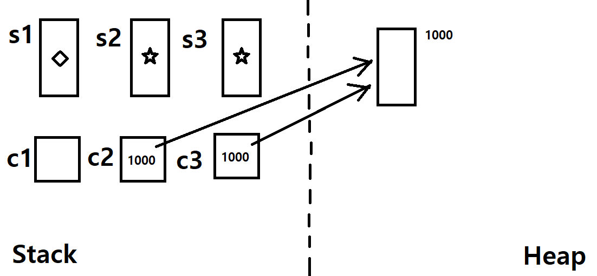
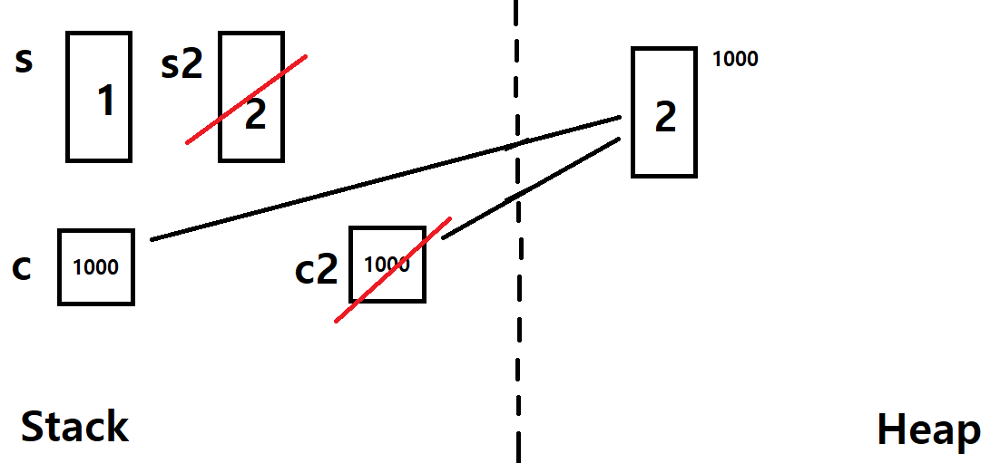

# 데이터 형식

- C#의 데이터 형식은 크게 값 형식(value type)과 참조 형식(reference type)으로 나뉘어져 있다. 참조 형식은 값이 있는 곳의 위치를 담는 형식이다.
- 값 형식에는 structure와 enum이 있고, 참조 형식에는 class와 delegate가 있다.

## 기본 데이터 형식

- C#에서는 데이터 형식 안에서 기본적으로 제공하는 기본 데이터 형식이 존재한다.

### 정수 계열 형식

- 크기와 데이터 범위에 따라 약 9가지 타입이 존재한다.
- int는 4바이트, long은 8바이트이며, 부호없는정수는 앞에 u가 붙는다. (uint, ulong)
- char 타입도 이에 해당하며, 2바이트로 유니코드 문자를 표현한다.
- 2진수, 16진수 등을 사용할 때는 ```0b```, ```0x```등의 접두사를 붙여서 사용한다
- 정수를 표현할 때, 중간에 ```_```를 붙여도 정상적으로 인식된다. 긴 숫자를 적거나 할 때 구분자로 사용할 수 있다.
```cs
int a = 123;
int b = 1_234_567;
int c = 0b_1111_1000;
```

### 부동 소수점 형식

- 소수점이 고정되어 있지 않고 움직이면서 수를 표현한다. 제한된 비트를 이용해 넓은 범위의 값을 표현한다.
- 소수점 표현과 부호 표현에 일부 비트를 사용해 정수 계열 형식과 같은 크기를 사용하지 못한다.
- float와 double이 있다

### decimal 형식

- 16바이트로, 실수 및 큰 수를 사용하기 위한 특수 타입이다.
- 정수, 부동소수점 타입과 다르게 더 큰 숫자, 정확한 실수를 표현할 수 있지만, 성능면에서 떨어진다.

### 문자 형식과 문자열 형식

- 문자 형식은 char로, C와 다르게 유니코드를 사용하여 2바이트이다
- 문자열 형식은 string으로, 여러개의 문자 형식을 묶어서 처리한다. C나 C++과 기능은 거의 같다.
- C나 C++처럼, 문자는 작은 따옴표로 문자열은 큰 따옴표로 처리한다

### 논리 형식

- bool 형식으로, 1바이트를 사용한다. C나 C++과 기능은 같다.

### Object 형식

- 직/간접적으로 모든 데이터 타입의 조상 역할을 하는 형식이다
- 모든 데이터 형식을 담을 수 있다.

### Nullable 형식

- 원래 값 타입에는 null값을 넣을 수 없게 되어있다.
- 그런데, 데이터베이스와 연동하게 되면서 0이 아닌 null값이 들어가는 변수가 필요해지면서 생기게 되었다.
- Nullable 형식은 ```데이터형식? 변수이름;```처럼 선언한다
- Nullable 형식에는 HasValue(값을 가지고 있는지 여부), Value(변수의 담겨있는 값)속성이 존재한다.
```cs
int a = null; // error
int? b;
b = null;
if(b.HasValue) // false
```

## 문자열을 숫자로, 숫자를 문자열로

- 문자 → 숫자 : int.Parse(문자열), Convert.ToInt32(문자열)
- 숫자 → 문자 : 변수명.ToString()
```cs
string s = "123";
int i = int.Parse(s); // 123
int i2 = Convert.ToInt32(s); // 123
string s2 = i.ToString(); // "123"
```

## 문자열 보간(string interpolation)

- 문자열에 서식이 지정된 식 결과를 포함하는 편리한 구문을 제공하는 기능
- 서식 문자열을 사용하여, 서식이 지정된 문자열을 표현할 수 있다.
- .NET의 형식 유형 - [Format types in .NET]([https://docs.microsoft.com/ko-kr/dotnet/standard/base-types/formatting-types](https://docs.microsoft.com/ko-kr/dotnet/standard/base-types/formatting-types))

```csharp
string str1 = "c=" + c + ", d=" + d;
string str2 = string.Format("c={0}, d={1}", c, d);
string str3 = $"c={c}, d={d}"; // c=1234567, d=1000
string str4 = $"c={c:N0}, d={d}"; // c=1,234,567, d=1000
```

## 공용 형식 시스템(Common Type System)

- C#의 모든 데이터 형식 체계는 공용 형식 시스템이라는 .NET 프레임워크의 형식 체계의 표준을 준수하게 되어있다.
- 공용 형식 시스템 .NET 프레임워크에 포함되어 있는 시스템 중 하나로, .NET 언어들간에 사용하는 형식의 표준이 되는 별칭을 정한 것이다.
- C#에서 int는 CTS로는 Int32로 사용되고, short는 Int16으로 사용된다.
- 그리고 C#에서 string은 CTS로는 String으로 쓰이고, decimal은 Decimal이다
- 그래서 C#의 형식을 입력할 때, String, Decimal로 입력하여 사용할 수도 있지만, 명확하게 말하면 올바르지 않은 방법이다.

# 클래스와 구조체의 생성

- 클래스는 대표적인 참조 타입, 구조체는 대표적인 값 타입이다

```csharp
// struct Snake, class Cat
Snake s1;
Snake s2 = new Snake(); // Snake s2;
Snake s3 = s2;
Cat c1;
Cat c2 = new Cat();
Cat c3 = c2;
```



- C#에서 참조 타입과 값 타입은 데이터의 생성방식이 다르다.
- C#에서는 포인터의 개념이 감춰져있어, 참조 타입을 생성 시 포인터의 개념으로 생성되게 된다.
- 값 타입(구조체, Snake)은 어떻게 값을 생성하든 무조건 Stack 영역에 그 값이 할당된다. 동적 할당이 불가능하며, 우리가 일반적으로 변수를 생성하는 방식을 따라간다.
- Snake 구조체의 s1과 s2는 똑같이 Stack영역에 변수를 생성하고, s3은 생성 될 때 s2의 값 자체를그대로 복사한다
- Cat 클래스의 c1은 Cat 클래스를 참조할 수 있는 참조 변수(포인터 변수)만 Stack에 생성되고, c2는 Heap 영역에 Cat 클래스가 생성되고 그 주소를 담은 c2 참조 변수가 Stack 영역에 저장된다. c3 역시 참조 변수로 생성되며, c2가 가리키고 있는 Cat 클래스의 주소 정보를 복사한다.

```csharp
Snake s;
s.age = 1;
Grow(s);
Cat c = new Cat();
c.age = 1;
Grow(c);
static void Grow(Snake s2){ s2.age++; }
static void Grow(Cat c2){ c2.age++; }0.
```



- Snake 구조체 s를 Grow 메서드에 넣으면, s의 값이 Grow 메서드로 복사되어 작동하고, Grow 메서드 내에서 s2에 저장되어 작동한 다음 s2는 해제되므로, 결과적으로 s의 값은 변하지 않는다
- Cat 클래스 c도 Grow 메서드에 넣으면, c의 참조 값이 Grow 메서드로 복사되어 작동하고, Grow 메서드 내에서 c2에 저장되어 c가 참조한 변수를 같이 잠조하여 c가 참조하는 변수의 값을 변경하고 종료되므로, 결과적으로 c의 값(c가 참조하는 변수의 값)은 증가하여 2가 된다.