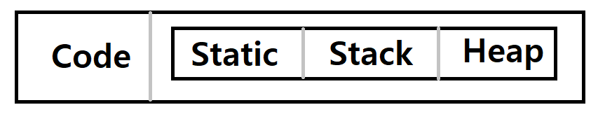

# 변수의 생성위치와 주소



- 32bit OS에서는 프로세스가 시작하면 2의 32승 바이트(약 4G) 만큼의 메모리 공간을 할당한다. 그리고 이를 크게 두 개의 영역으로 나눈다.
- 코드 영역 : 작성한 코드와 포함한 라이브러리가 들어간다
- 데이터 영역 : Static, Stack, Heap의 세가지로 나뉜다
    - Static 영역 : 전역변수, Static변수, 메모리가 해지되지 않는다. 프로그램 개발시 거의 사용하지 않는다.
    - Stack 영역 : 지역변수, 메모리가 가동 범위에 따라 자동으로 해지된다. 그래서 지역변수를 Auto 변수로 부르기도 한다.
    - Heap 영역 : 동적할당, 메모리가 자동으로 해지되지 않아서 수동으로 해지할 필요가 있다. 해지하지 않으면 메모리 누수 문제가 발생한다.
        - Java 이후에 생긴 대부분의 언어들은 자동으로 Heap영역을 정리해주는 garbage collection기능을 지원한다. 하지만 garbage collection기능은 작동하는 순간 일정 이상의 성능을 요구하기 때문에 짧은 순간 프리징이 걸린다. 그래서 1초가 중요한 프로그램에는 잘 사용하지 않는다.

# 동적 할당

- 프로그램에서 어떤 배열을 만들어야 하는데, 그 크기를 사용자의 입력 등 프로그램 실행 중에만 알 수 있는 경우가 생길 수 있다. 그리고 배열은 C에서 가변적으로 생성할 수 없다.
- 그래서 이런 경우에 동적 할당을 사용하여 원하는 크기만큼 메모리를 할당한다.
- C언어 에서는 a = malloc(size)로 생성하고 free(a)로 해제한다
- C++에서는 동적 할당 연산자가 있어, a = new int[size]처럼 생성하고, delete [] a 처럼 해제한다

# 함수 내 배열의 전달
- 함수에서 배열 등의 데이터를 가공하여 리턴하는 방법은 어떤것이 있을까?
- 아래로 내려갈수록 표준에 가까운 방법이다

```cpp
// 1. 배열을 만들어 주소값을 전달해준다
int* take1(){
	int ar[2];
	ar[0] = 3;
	ar[1] = 4; // ar이라는 배열을 생성해 값을 채우고 리턴한다
	return ar; // 하지만, ar은 함수가 종료되면 소멸되어 버린다
}
```
```cpp
// 2. 배열을 static으로 만들어 주소값을 전달해준다
int* take2(){
	static int ar[2];
	ar[0] = 3;
	ar[1] = 4; // ar이 소멸하지 않도록 static 변수로 선언하여 값을 채우고 리턴한다
	return ar; // ar은 전달되지만, static 변수는 소멸하지 않기 때문에 문제가 된다
}
```
```cpp
// 3. 배열을 동적 할당으로 만들어 주소값을 전달해준다
int* take3(){
	int* ar = new int[2];
	ar[0] = 3;
	ar[1] = 4; // static은 소멸하지 않아, 동적 할당으로 배열을 생성하고 값을 채워 리턴한다
	return ar; // 동적 할당을 이용해 ar은 전달되지만, 사용 후 소멸시켜줘야 하는 불편함이 있다
}
```
```cpp
// 4. 인자로 배열의 주소값을 받아 값만 넣어준다
void take4(int* ar){
	ar[0] = 3;
	ar[1] = 4; // ar이라는 공간자체를 전달받아 값만 채워준다.
}
```