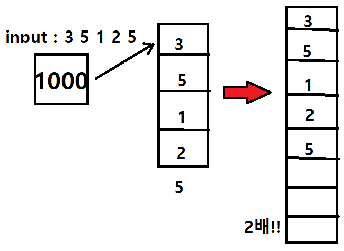

# List 컬렉션

- 배열처럼 사용할 수 있지만 기능이 더 좋은 List 컬렉션이 있다
- List는 제네릭 타입이기 때문에 선언 시 속성을 지정해준다.
- 평소에는 배열처럼 사용할 수 있다.

```csharp
1 List<int> list = new List<int>();
2 list.Add(1);
3 list.Add(2);
4 list.Add(3);
5 list.Remove(16);
6 list.RemoveAt(1);
7 list.RemoveAll(x => x < 3);
8 for(int i = 0; i < list.Count; i++)
9 	Console.WriteLine(list[i]);
```

1) 생성할 떄 <> 안에 원하는 타입을 입력한다. 처음 생성시 초기화를 안하면 빈 List가 생성된다.
2) Add() : List에 뒤에 값을 추가한다. List는 계속 그 크기가 변하기 때문에 계속 넣어줄 수 있다
5) Remove() : 해당 원소를 가진 값을 삭제한다.
6) RemoveAt() : 해당 위치의 값을 삭제한다.
7) RemoveAll() : 해당 조건의 모든 값을 삭제한다. 조건식에는 람다식이 들어간다
8) list.Count : 는 리스트의 크기를 반환해준다

## Capacity와 Count



- List는 Capacity라는 요소가 있다. List의 용량을 의미하며, 설정하지 않으면 기본값은 4이다. 반대로 Count는 값의 개수를 의미하며 용량과는 다르다.
- List는 내부적으로 capacity를 가지고 있고, 데이터가 들어오면 그 안에 데이터를 삽입하는 방식이다. 그런데 만약 데이터가 capacity를 넘어서게 되면, List는 capacity를 2배로 늘려서 새로 할당하고, 새로 할당한 메모리에 값을 옮긴다. 그리고 이전에 사용하던 capacity는 삭제하는 방식으로 크기를 늘려간다.
- 그래서 capacity를 예측 가능한 상황이라면, 생성자에서 capacity의 크기를 지정해주면 좀 더 효율적으로 List를 사용할 수 있게 된다.

## 생성자

- List<T>() : 기본 생성자이다. 빈 List가 생성된다.
- List<T>(int) : 생성시에 capacity를 지정해준다.
- List<T>(List) : 생성시에 다른 리스트의 값을 가진채로 시작한다. (복사)

## Add(), Insert()

- Add()는 List의 맨 끝에 값을 추가하는 작업이다.
- Insert()는 원하는 위치에 값을 추가하는 작업이다. 중간에 값을 추가하게 되면 이후 값들의 인덱스가 모두 바뀌므로, 반복 사용시에 주의가 필요하다

```csharp
list.Add(value); // List 뒤에 삽입한다
list.Insert(1, value); // 1번 index에 삽입한다
```

## Remove(), RemoveAt(), RemoveAll()

- Remove()는 원하는 값을 가진 개체를 삭제한다. RemoveAt()은 값 대신 위치를 이용해 삭제한다.
- RemoveAll()은 람다식을 사용하는 메서드로, 조건에 해당하는 모든 개체를 삭제한다

```csharp
**List<int> list = new List<int>();**
list.Remove(2);
list.RemoveAt(1);

class Person{ public string name; public int age; }
List<Person> list = new List<Person>();
list.RemoveAll(x => x.age > 21); // 나이가 21보다 큰 경우
list.RemoveAll(x => x.Name == "ringo"); // 이름이 ringo인 경우
list.RemoveAll(x => x.Name.Contains('o')); // 이름에 o가 들어간 경우
```

## Contain()

- List에 특정 요소가 있는지 확인하는 기능이다
- 참조타입의 경우, 값을 바로 가지고 있지 않아서, Contain()으로 검색할 경우 false가 나올 수 있다

```csharp
List<int> aa = new List<int>(){ 10 };
aa.contain(10); // true

List<Person> list = new List<Person>(){ "john", 22 };
Person j = new Person{"john",22};
list.contain(j); // false -> 참조형 타입으로, 위에서 만들어진 john과 밑에서 만들어진 john은 다르다
```

## ConvertAll()

- 람다식이 들어가는 메서드로, List의 특정 개체만 뽑아서 리턴해준다

```csharp
List<string> names = list.ConvertAll(x => x.Name);
// 위와 아래는 같다
List<string> names2 = new List<string>();
for(int i =0; i < list.Count; i++)
	names2.Add(list[i].Name);
```

## Exists(), Any(), All()

- 람다식이 들어가는 메서드로, 리스트에서 원하는 개체가 존재하는지 참/거젓을 리턴한다

```csharp
list.Exists(x => x.Name == "john");
list.Exists(x -> x.Age > 20);
list.Any(x => x.Age > 20);
```

- All()은 Any()와 반대 개념으로, 리스트의 모든 개체가 조건을 만족하는지 참/거짓을 리턴한다

```csharp
list.All(x => x.Age > 20); // 하나라도 20세 미만이 있다면 false이다
```

## Find(), FindAll(), FindLast()

- 람다식이 들어가는 메서드로, 리스트에서 원하는 개체가 존재하면 첫번째 해당 개체를 반환한다. 원하는 개체가 없다면 해당 타입의 기본형이 들어온다.
- FindLast()는 반대로 원하는 개체가 존재하면 그 마지막 개체를 반환한다.
- ※ 참조타입의 기본형 : null, 숫자타입의 기본형 : 0, bool의 기본형 : false

```csharp
Person p = list.Find(x => x.Age == 22);
List<Person> pList = list.FindAll(x => x.Age > 21);
```

## IndexOf(), LastIndexOf()

- 입력한 개체가 있는지 찾아서 해당 위치를 반환한다. LastIndexOf()는 IndexOf()와 같지만, 뒤에서부터 탐색한다는 차이점이 있다

```csharp
List<string> sList = new List<string>(){ "abc" };
IndexOf("abc");
```

## Reverse()

- List 개체의 순서를 뒤집는다

```csharp
List<int> list = new List<int>();
list.Add(1);
list.Add(2);
list.Reverse(); // { 2, 1 }
```

## ToArray()

- List 타입의 개체를 배열 타입으로 바꿔준다

```csharp
Person[] ar = list.ToArray();
```

## Sort(), OrderBy()

- List에서 제공하는 정렬 메서드이다. 기본적으로 오름차순 정렬이다.

```csharp
var l = new List<int>{3,5,1,2};
l.Sort();
l.Reverse(); // 오름차순 한 리스트를 뒤집어 내림차순으로 바꾼다
```

- 클래스 단위의 구문을 정렬하는 방법은 OrderBy(), OrderByDescending() 가 있다.

```csharp
list = list.OrderBy(x => x.Name).ToList();
```