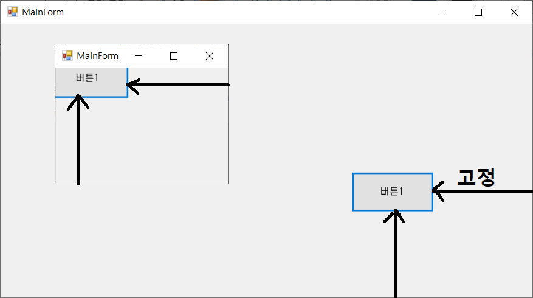
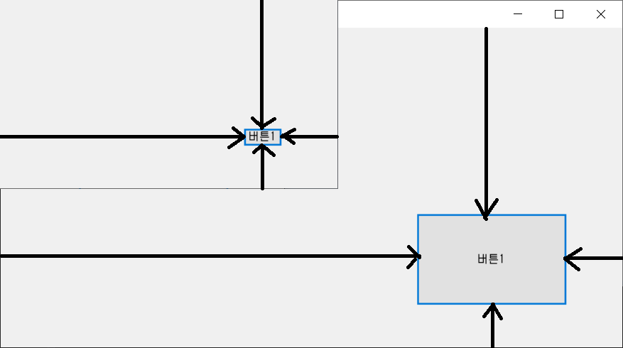

# Windows SDK

- Win32 API : C언어 기반의 윈도우 API
    - 기능이 증가하면서 함수가 10만개가 넘었다
    - 매크로나 식별자가 엄청나가 들어가 코드가 복잡하다
    - 언어적 확장이 이루어져, 기본 C언어 컴파일러로는 컴파일이 안된다
- MFC : Win32 API를 C++ 기반으로 자주 쓰이는 문법을 클래스로 묶은 것
    - Win32 API를 프레임워크화 한 것
    - Win32 API와 혼용하여 사용이 가능하다
    - .NET 이전의 윈도우 프로그램은 거의 MFC로 제작
    - C++ 기반이기 때문에 메모리 누수의 문제 등이 발생
- Visual Basic 6.0 등의 4세대 개발툴 : 화면으로 UI를 보면서 수정이 가능해짐
- Winform : C# 기반의 .NET 에서 돌아가는 윈도우 앱 개발 프레임워크
    - 4세대 개발툴처럼 UI를 보면서 끌어다 수정이 가능하면서 동시에 MFC와 같은 강력한 프로그래밍이 가능하다
    - 표 형식의 데이터를 출력하는 UI 형태에 강력하다
- WPF : Winform과 같은 C# 기반의 윈도우 앱 개발 프레임워크
    - 이전 API들의 GDI방식과는 다른 Vector방식으로 화면을 출력한다
    - 이외에 비디오, 오디오, 애니메이션 분야에 강점이 있다

# Winform 시작하기

- Windows Form App (.NET framework) 프로젝트를 연다
- 실행하면 메인에 기본적으로 작성된 코드가 있다

```csharp
using System.Windows.Forms;

static void Main()
{
	Application.EnableVisualStyles();
	Application.SetCompatibleTextRenderingDefault(false);
	Application.Run(new Form1());
}
```

- winform 프로젝트에는 콘솔 프로젝트에는 없던 System.Drawing 라이브러리와 System.Windows.Forms 라이브러리가 참조되어있다.
- Application 클래스 : System.Windows.Forms 네임스페이스에 속한 클래스로, Winform에서 제공하는 라이브러리 클래스이다.
- Run : 매개변수로 지정된 폼을 표시한다.

# 컨트롤

- 도구 상자에서 컨트롤을 드래그 앤 드롭으로 끌어와서 form에 놓으면 자동으로 컨트롤이 생성된다
- form의 Designer코드를 확인해 보면, 컨트롤은 하나의 클래스 인스턴스로 생성되어 있고, 위치(Point), 크기(Size), 이름(Name) 등의 내용이 자동으로 입력되어 있다.
- 위치 정보는 왼쪽 위(0,0)를 기준으로 하여 저장되어 있다.
- 물론 코드로 작성해 컨트롤을 만들 수 있지만 디자인을 이용해 작업하는 것이 더 편하다. 또한, 생성한 컨트롤의 세부 설정도 코드로 수정하지 않고, 속성 창을 통해서 수정할 수 있다.

```csharp
// form 추가시 기본으로 생성되는 부분
public patial class MainForm : Form
{
	public MainForm()
	{
		InitializeComponent();
	}
}
```

- 컨트롤의 이름은 보통 ```컨트롤명의줄임말3글자+이름```의 형태로 지어준다
    - Label 컨트롤은 ```lbl+이름``` (lblTime)

# 컨트롤의 이벤트

- 컨트롤은 각각 이벤트를 가지고 있고, 컨트롤의 설정창에서 이벤트에 해당하는 이벤트 핸들러를 등록할 수 있다.
- 따로 만들어 둔 이벤트 핸들러가 없거나, 해당 이벤트 고유의 이벤트 핸들러를 만들고 싶을 떄는 이벤트를 더블클릭하면 ```컨트롤이름_이벤트이름```으로 자동으로 메서드를 만든다.
- 또는, 해당 컨트롤러를 더블클릭하면 해당 컨트롤에 대표되는 이벤트의 핸들러를 자동으로 메서드로 만든다

```csharp
private void button1_MouseClick(object sender, MouseEventArgs e)
```

- 여러 이벤트에 같은 핸들러를 등록하는 것도 가능은 하다.
- 이벤트를 작성하다보면 중복되는 코드가 생길 수 있다.
- 예를 들어, 컨트롤의 메서드 중에 PerformClick() 메서드가 있다. 이는 해당 컨트롤의 클릭 이벤트를 실행한다는 의미로, 이런 메서드를 이용하면 중복되는 클릭 이벤트를 단일 메서드의 이벤트로 정리할 수 있다.

# Anchor와 Dock

- Anchor는 해당 컨트롤이 form안에 어느 방향에서 고정되도록 한다
- Anchor를 설정하면 창을 늘리거나 줄여도 지정한 위치의 창에 맞게 붙어서 움직인다. 기본값은 top, left이다



- Anchor을 right, bottom으로 설정하면 컨트롤와 우측 아래간의 간격이 고정되어, 창이 늘어나거나 줄어들어도 우측 아래의 간격에 따라 컨트롤이 움직인다



- 만일 Anchor을 top, bottom, left, right를 모두 선택하면, 간격을 맞추기 위해 컨트롤의 크기가 줄어든다.
- Dock도 Anchor와 비슷하지만, 컨트롤을 아예 상,하,좌,우,전체 위치 중 하나로 고정시켜 버린다.

# Form

- 기본적으로 생성하는 폼은 Form클래스를 상속받고 있다.
- Form 클래스는 Control 클래스를 상속받고 있고, Control 클래스는 Component 클래스를 상속받고 있다.
- ContainerControl은 다른 컨트롤을 올릴 수 있는 컨트롤(클래스)로, Form클래스 안에도 들어있다. 이 클래스 덕분에 폼 안에 컨트롤을 올릴 수 있다.
- 보기 - 다른 창 - 문서 개요 메뉴를 열면, 폼에 존재하는 컨트롤들의 계층을 확인할 수 있다
- form의 이름은 '~Form'처럼 Form이 마지막에 오게 이름을 짓는것이 관리하기 쉽다

# 이미지 삽입하기

- 프로젝트 속성에서 리소스 탭을 선택한 후, 이미지를 선택하고 삽입할 이미지를 끌어다 놓으면 프로젝트에 리소스로 추가가 된다
- 이후, 컨트롤의 image 속성을 통해 리소스로 추가한 이미지를 불러올 수 있다
- 아이콘을 사용하려면 ico확장자의 파일이 필요하다. 그래서 ico파일을 직접 구하거나, 이미지를 ico로 변환하는 사이트나 툴을 이용해 구해야 한다

- 버튼을 클릭했을 때, 다른 폼이 열리도록 하고 싶을 때는 먼저 해당 폼 클래스 인스턴스를 생성해준다

```csharp
// 열고자 하는 폼의 객체 생성
OpinionForm form = new OpinionForm();
```

- 창을 띄우는 방식은 modal방식과 modeless방식이 있다
- modal방식은 창을 띄우면 띄운 창이 닫히기 전까지 이전 창으로 돌아가지 못한다
- modeless방식은 창을 띄워도 이전 창으로 자유롭게 돌아갈 수 있다.
- modal방식은 ShowDialog() 메서드로 띄우고, modeless방식은 Show() 메서드로 띄워준다

```csharp
form.ShowDialog();
form.Show();
```

- 창을 띄우면서 데이터를 넘겨주고 싶다면, 폼의 생성자를 추가하여 인자로 데이터를 받으면 된다.

```csharp
OpinionForm form = new OpinionForm(txbTarget.Text);
```

- 반대로 창이 닫히면서 데이터를 넘기고 싶다면, 열려있던 폼 클래스에 프로퍼티를 만들어두고, ShowDialog()이후 시점(창이 닫힌 후)에 맴버값을 받아오면 된다

```csharp
string message = $"나는 {txbTarget.Text}에 대해 {form.Opinion}라고 생각해";
```

- 또는 창이 닫힐 떄 조건값을 DialogResult로 받을 수 있는데, 이것을 이용해 값을 받아올 수 있다.

```csharp
// 자식 폼
private void btnOK_Click(object sender, EventArgs e){
	DialogResult = DialogResult.OK
}
// 부모 폼
form.ShowDialog();
if(form.DialogResult == DialogResult.OK)
{
	string message = $"나는 {txbTarget.Text}에 대해 {form.Opinion}라고 생각해";
}
```