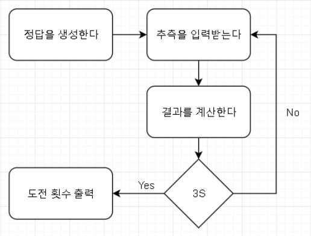

# 01. 알고리즘 기술

- 순서도, 글 등으로 프로그램의 흐름을 설계한다



- 이후, 코딩하기 전에 설계한 내용을 주석으로 다시 정리한다

```cpp
int main()
{
	// 1. 중복되지 않는 3개의 정수(0~9)로 이루어진 정답을 생성한다
	// 2. 추측을 입력받는다
	// 3. 결과를 계산한다
	// 4. 3 Strike가 아니면 2번으로 돌아간다
	// 5. 도전 횟수를 출력한다
}
```

# 02. 길고 못생긴 코드(Ugly Code)

- 이전 단계에서 작성한 내용에 따라 단순하게 코드를 작성한다

```cpp
// 1. 중복되지 않는 3개의 정수(0~9)로 이루어진 정답을 생성한다
int answer0; int answer1; int answer2;
//...

// 2. 추측을 입력받는다
int tryCount = 0;
while(true)
{
	tryCount++;
	// ...
	
	// 3. 결과를 계산한다
	int strike = 0; int ball = 0; int out = 0;
	// ...
	
	// 4. 3 Strike가 아니면 2번으로 돌아간다
	if(strike == 3)
		break;
}

// 5. 도전 횟수를 출력한다
cout << "도전횟수 : " << tryCount << endl;
```

# 03. 상수를 사용하기

- 반복적으로 사용되거나 하드코딩 된 숫자 데이터를 전처리기나 global const 변수를 사용하여 바꿔준다

```cpp
#define MAX_NUMBER 10 // C에서 사용하는 방법
const int DIGIT = 3; // C++에서 사용하는 방법
// ...
answer0 = rand() % MAX_NUMBER;
// ...
if(strike == DIGIT)
```

# 04. 컬렉션(자료구조)/배열

- 연속되고 같은 타입의 데이터를 묶는 작업이다.
- 배열은 인덱스로 접근이 가능하고, 원소에 접근하는 속도가 빠르다(O(1)). 하지만 배열은 크기가 고정된다는 단점이 있다.
- 그러다보니 크기가 고정되면 안되는 상황에서는 여러가지 자료구조를 사용하게 되는데, Vector, ArrayList, List, Dictionary 등이 존재한다.
- 지금은 배열로 충분히 구현 가능하므로, 배열을 사용하자

```cpp
int answers[DIGIT]; // 변수명을 지을 때 단수와 복수를 명확히해주자

for(int i = 0; i < DIGIT; i++)
	answers[i] = rand() % MAX_NUMBER;

for(int i = 0; i < DIGIT; i++)
	cout << answers[i] << " ";
cout << endl;

int guesses[DIGIT];

for(int i = 0; i < DIGIT; i++)
	cin >> guesses[i];

for(int i = 0; i < DIGIT; i++)
	cout << guesses[i] << " ";
cout << endl;

for(int i = 0; i < DIGIT; i++)
{
	int j = (i + 1) % DIGIT;
	int k = (i + 2) % DIGIT;

	if(guesses[i] == answers[i])
		strike++;
	else if(guesses[i] == answers[j] || guesses[i] == answers[k])
		ball++;
	else
		out++;
}
```

# 05. 사용자 정의 타입/구조체

- 순서가 없거나, 타입이 다른 데이터를 묶는 작업이다
- 언어에서 기본적으로 제공하는 타입들은 primary type라고 부르고, primary type으로 구현할 수 없는 타입을 직접 구현하기 위한 타입을 user-defined type/custom type이라고 부른다
- C에서는 struct, union, enum, 세 가지의 user-defined type/custom type을 제공한다
- 야구게임에서 strike, ball, out은 비록 같은 int형이지만 배열로 묶기에는 그 속성이 조금 다르다. 하지만 하나로 합쳐지면 하나의 의미를 가지기 때문에 구조체로 묶어준다.

```cpp
struct Result
{
	int strike;
	int ball;
	int out;
};
```

# 06. 함수(1)

- 비슷한 코드를 밖으로 빼내어 함수로 만들어준다

```cpp
// 처음, 정답을 출력하는 부분을 빼내어 함수로 만든다
void printAnswers(int* answers)
{
	cout << "[정답] ";
	for(int i = 0; i < DIGIT; i++)
		cout << answers[i] << " ";
	cout << endl;
}

// 하지만, 출력하는 것이 정답만 있는 것이 아니기 때문에, 함수의 구조를 변형해준다
void printNumbers(int* numbers, const char* prefix) // 문자열을 포인터로 받을 때는 const를 붙여줘야 한다
{
	cout << prefix;
	for(int i = 0; i < DIGIT; i++)
		cout << numbers[i] << " ";
	cout << endl;
}
```

# 07. 함수(2)

- 모듈화. 단위기능별로 기능을 떼어낸다.
- 사용자가 구체적인 내용을 몰라도 될 정도로 빼낸다

```cpp
void createAnswer(int* answers) // 반환값처럼 사용하는 매개변수를 output parameter라고 한다
{
	srand(0);
	while(true)
	{
		//...
	}
}

void inputGuesses(int* guesses)
{
	// ...
}

void calculateResult(Result* result, int* answers, int* guesses) // 구조체는 기본적으로 포인터로 넘기는것이 효율이 좋다
{
	// ...
}

void printResult(Result* result)
{
	// ...
}

bool isCorrectResult(Result* result)
{
	// ..
}
```

# 08. 여러 파일 컴파일하기

- 파일이 하나로 되어있게 되면, 여러 사람이 협업을 하기 어려워진다. 그래서 파일을 분할하여 컴파일 하는 방법을 사용한다

```cpp
// 조건부 컴파일(Conditional Compile)
#ifndef __Result__ // __Result__가 정의되어 있지 않다면 endif까지 실행한다
#define __Result__ // 지금부터 __Result__가 정의된다
// ...
#endif

// 아래의 문법을 지원하는 컴파일러에서는, 다음과 같이 한줄로도 할 수 있다
#pragma once
```

- 헤더 파일을 여러 파일에서 include하여 사용할 경우 문제가 될 수 있다. 그래서 여러 파일에서 여러번 첨부되는 것을 방지하기 위해  조건부 컴파일을 사용한다

```cpp
// Constant.h
#pragma once
#define MAX_NUMBER 10
#define DIGIT 3
```

```cpp
// Result.h
#pragma once
struct Result
{
	int strike;
	int ball;
	int out;
};
// Result와 관련된 함수 선언
void calculateResult(Result* result, int* answers, int* guesses);
void printResult(Result* result);
bool isCorrectResult(Result* result);

// Result.cpp
#include <iostream>
#include "Result.h"
#include "Constant.h"
void calculateResult(Result* result, int* answers, int* guesses) {//...}
void printResult(Result* result) {//...}
bool isCorrectResult(Result* result) {//...}
```

```cpp
// Answer.h
#pragma once
void createAnswer(int* answers);

// Answer.cpp
#include <iostream>
#include "Constant.h"
void createAnswer(int* answers) {//...}
```

```cpp
// Guess.h
#pragma once
void inputGuesses(int* guesses);

// Guess.cpp
#include <iostream>
#include "Constant.h"
void inputGuesses(int* guesses) {//...}
```

```cpp
// Number.h
#pragma once
void createAnswer(int* answers);

// Number.cpp
#include <iostream>
#include "Constant.h"
void createAnswer(int* answers) {//...}
```

```cpp
// main.cpp
#include <iostream>
#include "Constant.h"
#include "Result.h"
#include "Answer.h"
#include "Guess.h"
#include "Number.h"
```