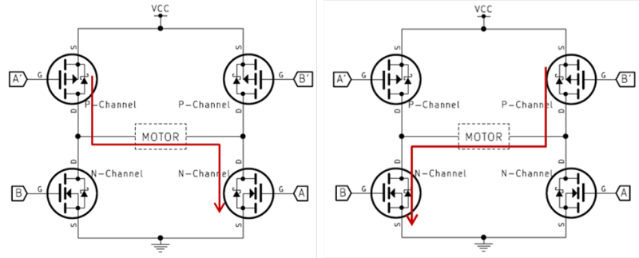

# 라즈베리파이 tkinter 라이브러리 사용

```python
# tkinter 라이브러리를 사용해 버튼으로 LED 켜고 끄기
1 import tkinter as tk # python2는 import Tkinter
2 root = tk.Tk()
3 label = th.Label(root, text="press button")
4 button = tk.Button(root, text="LED", command=func)
5 label.pack()
6 button.pack()
7 root.mainloop()
```

1_ tkinkter 라이브러리를 불러온다. 파이썬 버전에 따라 라이브러리 명칭이 변할 수 있기 때문에, 약칭(as tk)을 설정해두면 나중에 라이브러리 명칭만 바꾸면 된다

2_ tkinter 윈도우를 사용할 변수를 지정, 기존의 방식과 동일하다.

3_ 라벨을 설정한다, 기존의 방식과 동일하다.

4_ 버튼을 설정한다. 기존의 방식과 동일하다.

5_ 6_ 라벨과 버튼을 출력해준다. 기존의 방식과 동일하다

7_ tkinter 윈도우를 출력하고, 종료되기 전까지 루프상태가 된다. 그러므로 기존에 사용하던 whlie True 구문은 사용할 필요가 없다

# LED 밝기 조절하기

## PWM 신호

- LED의 밝기를 조절하려면 PWM신호를 사용합니다
- 일정 간격으로 신호의 하이 레벨과 로우 레벨의 폭을 전환해서, 디지털 신호에서 표현할 수 없는 중간값을 유사하게 표현하는 방식이다
- 하이 레벨의 시간이 짧을수록 LED가 어둡게 켜지고, 길수록 밝게 켜진다. 이 떄, 신호 주기에 대한 펄스 폭 비율을 듀티 비(duty ratio)라고 한다
- PWM 신호를 출력하기 위해 RPi.GPIO 라이브러리를 불러오고, PWM 객체를 생성한다

```python
import RPi.GPIO as GPIO
p = GPIO.PWM(channel, frequency)
```

- channel : PWM 신호를 출력할 핀 번호
- frequency : PWM 신호의 주파수

```python
1 dc = [0,1,2,3,4,5,6,7,8,9,10,12,13,15,20,30,50,70,100]
2 p = GPIO.PWM(LED, 100)
3 p.start(0)
4 whlie True:
5 	for val in dc:
6 		p.ChangeDutyCycle(val)
7 		time.sleep(0.1)
8 	dc.reverse()
```

1_ 듀티 비 변경에 사용할 리스트

2_ PWM 객체 생성

3_ PWM 객체 시작. 인자는 듀티비.

6_ 리스트값에 따라 듀티비를 변경

7_ 변경값 확인을 위한 딜레이

8_ for문이 끝나면 리스트값을 반전

## tkinter 슬라이더 사용

- 슬라이더는 범위의 설정 값에서 적절한 값을 선택할 때 사용한다

```python
1 root = tk.Tk()
2 led_val = tk.DoubleVar() # 슬라이더 값을 저장할 변수 생성
3 led_val.set(0) # 0으로 설정
4 s = tk.Scale(root, label='LED',orient='h',
5 							from_=0, to=100, variable=led_val, command_change_duty)
6 s.pack()
7 root.mainloop()
```

2_ 슬라이더 값을 저장할 Variable 객체를 생성(double type)

3_ Variable 객체의 값을 0으로 설정

4_ 슬라이더 생성.

- orient : 슬라이더를 표시할 방향, 수평(h)또는 수직(v)
- from_, to : 슬라이더의 최소값, 최대값
- variable : 슬라이더에 할당할 tkinter의 Variable객체
- command : 슬라이더 값을 변경했을 시 호출될 함수 또는 매서드

```python
def change_duty(dc):
	p.ChangeDutyCycle(led_val.get()) # p.ChangeDutyCycle(int(dc))
```

- 슬라이더의 command의 경우, 변경된 값을 인자로 넘겨주기 때문에 인자를 하나 받아줘야 한다.
- 변경된 인자값을 넘겨주기 때문에, variable로 받은 변수를 굳이 사용하지 않아도 값을 활용할 수 있다. 단, 값은 str형으로 전달되므로 주의가 필요하다.

# 라즈베리파이 모터 사용

## DC 모터의 구동 원리



- DC모터는 2개의 선이 있는데, 이 선에 +에서 -로 전류가 흐르느냐, -에서 +로 전류가 흐르느냐에 따라 모터의 회전 방향이 바뀐다.
- 이 때 전류의 방향을 바꿔줄 수 있는 회로를 구성해야 하는데, 이 회로를 H-bridge라고 한다
- 왼쪽 위와 오른쪽 아래가 활성화되면 전류가 왼쪽에서 오른쪽으로 흐르고, 반대로 활성화되면 반대로 전류가 흐르게 된다.
- 이를 자동으로 제어하기 위해 스위치를 트랜지스터로 바꾸고, 이를 NOR게이트로 연결해 제어하는 모터 드라이버 칩(모듈)이 있다.
- 2개의 디지털 신호와, PWM으로 정방향, 역방향 제어 및 속도 조절이 가능하다

## 스태핑 모터의 제어


- 모터 드라이버 IC에 연결하여 제어한다
- 모터 드라이버에 4개의 핀에 제어 신호를 그림처럼 순차적으로 변경해 주어야 한다
- 그림처럼 신호를 주게 되면 언제나 스테핑 모터 한 쌍만 전기가 통하는 상태가 된다. 이를 "1상 여자" 라고 한다. 이 외에도 2상여자, 1-2상여자 등이 있다
- 단순하게 1상여자를 표현하는건 다음과 같은 방법으로도 가능하다

```python
for i in range(0,4):
	GPIO.output(STEP_PIN[i], GPIO.HIGH) # 1개의 핀에 HIGH
	GPIO.output(STEP_PIN[i-1], GPIO.LOW) # 이전 핀은 LOW
	time.sleep(0.01)
```

- 하지만, 2상여자나 1-2상여자 등의 방법을 사용해주려면 코드 자체를 변경해야 하므로, 신호 출력 패턴을 저장하는 리스트를 만들어 출력 패턴이 바뀌면 리스트만 바꾸면 되는 방식으로 수정할필요가 있다.
- 이 때 사용하면 좋은 것이 collections 라이브러리의 deque객체이다
- deque객체에는 내장형 리스트에는 없는 rotate 메서드가 있다
- rotate는 리스트 요소 전체를 인수로 지정한 숫자만큼 오른쪽으로 순환하는  메서드이다

```python
sig = deque([1, 0, 0, 0])
step = 100
dir = 1
# ...
for cnt in range(1, step):
	GPIO.output(STEP_PIN[0], sig[0])
	GPIO.output(STEP_PIN[1], sig[1])
	GPIO.output(STEP_PIN[2], sig[2])
	GPIO.output(STEP_PIN[3], sig[3])
	time.sleep(0.01)
	sig.rotate(dir) # 출력 신호 패턴을 오른쪽으로 순환. dir이 -1이면 역순으로 순환(회전 방향이 반대)
```

```python
sig = deque([1, 0, 0, 0]) # 1상여자
sig = deque([1, 1, 0, 0]) # 2상여자 - 1-2상여자는 둘을 조합해서
```

- 또는 출력 신호 패턴 자체를 16진수로 저장해, 비트 연산을 이용해 작동시키는 방법이 있다. 이 또한, 다른 상여자를 사용할경우, 리스트의 인자를 바꿔주면 해결된다

```python
step_data = [0x01, 0x02, 0x04, 0x08]

for i in range(0,4):
	for k in range(0,4):
		GPIO.output(step_pin[k], step_data[i] & (0x01<<k))
	time.sleep(0.01)
```

```python
step_data = [0x01, 0x02, 0x04, 0x08] # 1상여자
step_data = [0x03, 0x06, 0x0C, 0x09] # 2상여자
step_data = [0x01, 0x03, 0x02, 0x06, 0x04, 0x0C, 0x08, 0x09] # 1-2상여자
```

# 라즈베리파이 피에조 부저

- LED 밝기 조절 처럼 PWM을 사용한다. 대신 이번에는 듀티 비를 조절하는것이 아니라 주파수를 조절한다
- 피에조 부저는 주파수에 따라 다른 음계를 낼 수 있다는 점을 이용해, PWM의 ChangeFrequency 함수를 활용해 주파수를 변경하며 음을 낼 수 있다

```python
1 node = [130, 147, 165, 174, 196, 220, 247, 261, 293]
2 p = GPIO.PWM(LED, 1)
3 p.start(90)
4 whlie True:
5 	for val in dc:
6 		p.ChangeFrequency(val)
7 		time.sleep(0.5)
8 	node.reverse()
```

2_ frequency는 0 이상으로 설정해야하기 때문에 초기값은 1로 설정한다

3_ 듀티비는 높게 설정해둔다(듀티비는 음량에 영향을 미친다)

6_ ChangeFrequency 함수를 사용해 주파수를 조절해준다