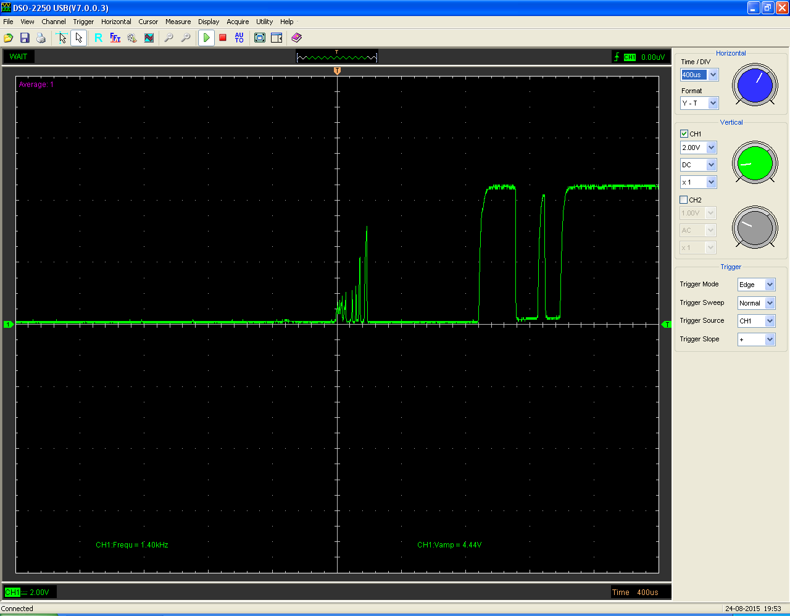
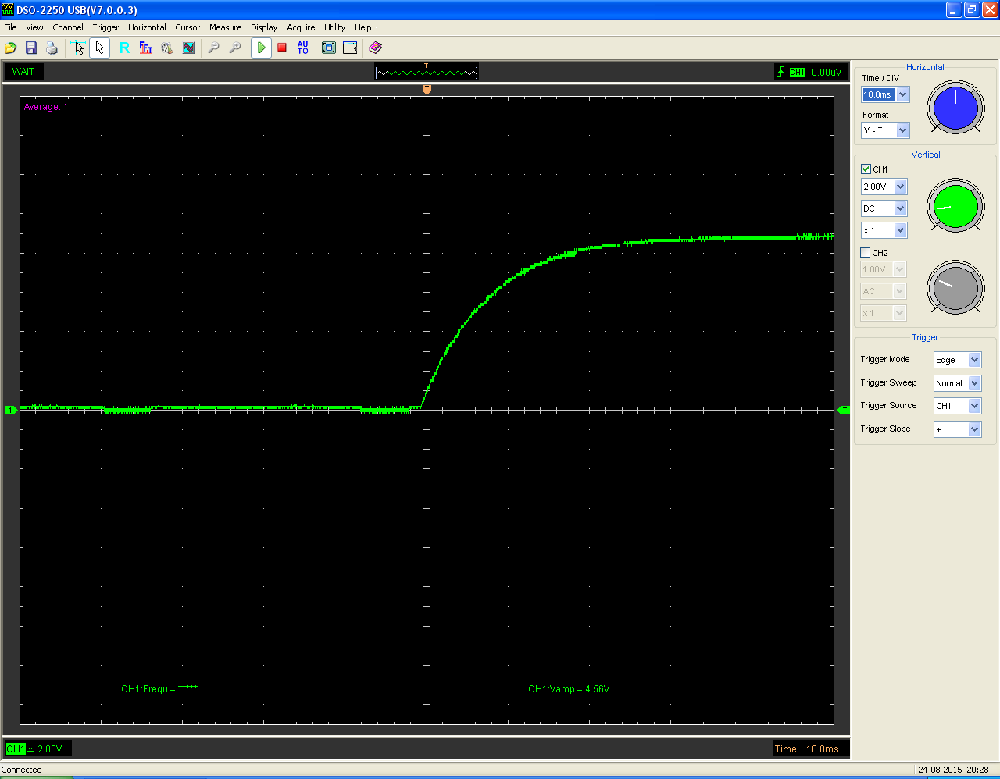

# 스위치 바운싱

- 스위치에서 발생하는 펼연적인 하드웨어의 결함이다
- 스위치를 누르면 회로의 접점이 붙는데, 그 접점이 붙었다가 떨어지는 순간에 발생하는 것이 바운스이다.
- 통통 튀는것처럼 생기는 진동 잡음으로 인해 접점이 붙는 순간에 우리가 생각한 것 보다 더 많은 붙고 떨어짐이 발생한다
- 이 현상으로 인해 스위치를 사용할 때 제대로 인식하지 못하는 경우가 있다. (여러번 on/off 된 것으로 인식해서) 회로에서 스위치를 사용하려면 반드시 디바운싱을 해주고 사용해야 오류없이 사용할 수 있다

# 디바운싱

- 디바운싱이란, 하드웨어 결함으로 발생하는 바운싱을 해결하는 것이다

## 하드웨어적 디바운싱

- 가장 간단한 방법은 스위치 양 극에 캐피시터(콘덴서)를 달아주는 것이다
- 캐피시터는 전압 변화를 흡수하여 진동 잡음을 거의 없애준다.
1. 스위치 작동 시 전압 변화(오실로스코프)



2. 캐피시터 연결 후 스위치 작동 시 전압 변화(오실로스코프)



- 출처 : [https://www.allaboutcircuits.com/technical-articles/switch-bounce-how-to-deal-with-it/](https://www.allaboutcircuits.com/technical-articles/switch-bounce-how-to-deal-with-it/)

## 소프트웨어적 디바운싱(1)

- 소프트웨어적으로 디바운싱하기 위해서는 처음의 버튼 상태를 저장하고 1~5ms정도 기다리고 나서 버튼 상태를 저장하는 것이다. 그러면 그 시간 동안 발생한 바운싱으로 발생할 오류를 방지할 수 있다
- 스위치의 **이전 상태**와 **현재 상태**를 저장하는 변수를 만들고, 해당 스위치의 **토클 상태**를 저장할 변수도 만들어 준다.
- 루프의 처음에 **현재 상태**를 저장하고, **이전 상태**와 비교하여 변화가 발생하면 **토글 상태**를 바꾸어주고, **토글 상태**에 따라 다른 디바이스를 제어해준다
- 그리고, 루프의 끝에 바운싱으로 인한 오류를 방지하기 위해 ```sleep```을 걸어주고, **현재 상태**를 **이전 상태**에 저장해주면 된다. 그러면 다음 루프에서 바로 **이전 상태**와 **현재 상태**를 비교할 수 있게 된다.

## 소프트웨어적 디바운싱(2) - 인터럽트

- 지연 시간을 발생시킴으로서 바운싱 오류를 잡았지만, 지연 시간이 발생한 만큼 프로그램이 지연되거나, 다른 디바이스나 다른 모듈에서 지연 시간을 발생시키면 그 시간동안은 스위치를 제대로 인식하지 못하게 된다
- 또한, 스위치의 변화를 인식하기 위해 주기적으로 계속 확인해야 하기 때문에 시스템이 비효율적이다
- 그래서 GPIO에서 제공하는 인터럽트를 사용해 디바운싱을 하게 되면, 좀 더 효율적인 디바운싱이 가능해진다
- GPIO에서 스위치가 눌릴 때 해당 스위치 입력 포트에서 인터럽트가 발생하고, 인터럽트 서비스 루틴에서 **토글 상태**를 바꾸어준다. 이 떄, 약간의 지연 시간을 넣어주면 조금 더 정교하게 작동한다. (인터럽트라도, 진동 잡음으로 인해 여러번 호출 될 수 있으므로)
- 파이썬에서 해당 GPIO 함수를 사용해 인터럽트 서비스 루틴을 지정해 줄 수 있다

```python
// GPIO 핀에 대한 이벤트 감지 추가하기
import RPi.GPIO as GPIO
GPIO.add_event_detect(channel, edge, callback, bouncetime)
```

- channel - 이벤트를 감지할 채널/핀
- edge - 이벤트를 잡을 엣지 유형. RISING, FALLING, BOTH
- callback - 이벤트에서 호출 할 콜백 함수, 단일 매개변수인 채널 번호가 콜백시 전달됨.  ```callback=myFunc```처럼 사용
- bouncetime - 두 콜백 사이의 최소 시간. 중간 이벤트는 무시된다. ```bouncetime=300```처럼 사용

## 디바운싱 결론

- 제시한 방법들을 잘 조합하여 사용하면, 거의 확실한 스위치 디바운싱이 가능하다.
- 하지만, 여러 장치에서 동시 다발적으로 인터럽트가 발생하여 지연이 발생한다면, 이 경우에는 결국 멀티 프로세스나 멀티 쓰레드 등의 멀티 기반 프로그램이 필요할 것이다. 라즈베리파이는 운영체제가 있는 보드이므로 이런 것이 가능하다

# 인터럽트

## 마이크로컨트롤러의 프로그램 작동방식

- 마이크로컨트롤러 내부에는 CPU 역할을 하는 마이크로프로세서(Core)가 있다
- 메모리는 프로그램 메모리와 데이터 메모리로 나뉜다. 업로드한 프로그램은 프로그램 메모리에 들어가고, 프로그램에서 필요한 데이터나 생성한 변수 등은 데이터 메모리로 들어간다.
- 데이터가 왔다갔다 해야하기 때문에 데이터 메모리는 속도가 빠른 RAM을 사용하고, 프로그램 메모리는 보드의 전원이 나가도 프로그램이 보존되어야 하기때문에 ROM을 사용한다.
- 컴퓨터가 켜지면 마이크로 프로세서에서 프로그램 메모리에 들어있는 명령어를 호출(fetch)해서 해석(Decoding)하고 실행(excute)하는 과정을 거친다
- 예를 들어 ```c = a + b```와 같은 연산을 실행 시, 실제로는 아래와 같은 복잡한 과정을 거친다
    1. 레지스터1에 데이터 a 값을 가져온다
    2. 레지스터2에 데이터 b 값을 가져온다
    3. 레지스터1과 레지스터2를 더해 레지스터3에 저장한다
    4. 레지스터3의 값을 c에 저장한다
- 마이크로컨트롤러 내부의 GPIO블럭이 존재해, 입력받은 값이 변화(엣지)가 생기면 CPU에 신호(interrupt)를 넘겨준다
- 인터럽트가 발생하면, 메인으로 실행되던 부분에서 벗어나 지정된 함수를 수행한다. 이를 인터럽트 서비스 루틴이라고 부른다
- 인터럽트가 발생하면 CPU는 실행하던 명령어를 데이터 메모리 내에 Stack 영역에 보내고, 인터럽트 서비스 루틴을 수행한다
- 인터럽트가 발생 중에 다른 인터럽트가 다시 발생하면, CPU내에 설계된 우선순위에 따라 해당 인터럽트를 무시하거나, 끝난 뒤에 진행하게 된다
- 라즈베리파에이 들어있는 ARM칩은 선점형 인터럽트를 사용한다

## 폴링(Polling)

- 특정 주기마다 스레드를 돌면서 시그널이 들어왔는지 확인하는 방식
- 소프트웨어적으로 시그널을 확인하는 것
- 특정 주기마다 계속 확인해야 하기 때문에 시스템의 리소스를 많이 먹는다는 단점이 있다
- 또한, 정확한 타이밍에 시그널이 들어왔는지 확인하는 것은 불가하고, 주기에 따른 오차가 존재한다
- 장점은, 구현이 쉽고 우선순위 변경이 용이하다는 점이 있다

## 인터럽트(Interrupt)

- 외부의 인터럽트 핀에 신호가 들어오면 즉시 인터럽트 소스를 실행하고 다시 원래의 코드로 돌아오는 방식이다
- 하드웨어적으로 시그널을 확인하는 것이다
- 커널의 인터럽트 핸들러가 인터럽트를 확인하고, 인터럽트가 발생했다면 인터럽트 쓰레드로 발생을 알려준다
- Polling보다 구현이 복잡하다는 단점이 있지만, 시그널이 들어온 정확한 타이밍을 알 수 있고, 반응시간이 빠르다
- 또한, 인터럽트 발생시에만 처리를 하기 때문에 시스템의 부하가 적다
- 인터럽트의 시퀸스는 다음과 같다
    1. 인터럽트 핀에 신호가 들어오면
    2. 데이터 메모리의 스택 공간에 실행중이던 주소번지를 저장하고
    3. 인터럽트 서비스 루틴을 실행
    4. 인터럽트 서비스 루틴을 마치면 저장 되어 있던 스택에 작업중이던 주소번지를 읽어 들여
    5. 다시 작업하던 곳으로 북귀하여 하던 일을 이어간다. 

## 폴링 방식과 인터럽트 방식

- 폴링 방식은 신호 유무를 판단하기 위해서 입력이 들어왔는지 안들어왔는지를 MCU가 계속 확인해야 하기 때문에 소스 군데군데 상태를 체크 할 수 있도록 코딩을 해야 한다
- 하지만, 인터럽트 방식은 메인 루틴에서 하던 일을 잠시 멈추고 실행되는 것이기에 메인루틴 프로그램만 작성하면 된다

## 인터럽트 서비스 루틴(ISR)

- 인터럽트는 프로세서에 중대한 상황과 기타 사용자가 정의하는 상황을 번호로 매겨놓는다. 그리고 그 일이 생기면 현재 작업을 중단하고 우선 처리하게 된다. 이를 프로세서에서 롬으로 정의해놓는다. 즉, 수정이 불가능하다.
- 그래서 **인터럽트 백터테이블**이라는 것을 램에 만들어 두고, 이 부분에 처리해야 할 내용을 적어두게 된다. 하지만 메모리의 할당이 적어서 많은 내용을 쓰지는 못하고, 다른 함수를 호출하게 되어있다.
- 인터럽트가 걸리고 정해진 내용을 처리하는 과정을 **인터럽트 서비스**라고 표현한다. 그리고 만들어진 내용(함수)을 **인터럽트 서비스 루틴**이라고 한다
- PC에서 이런 인터럽트가 있고, 인터럽트가 걸렸다는 신호로 IRQ를 사용한다. IRQ란 Interrupt ReQuest(인터럽트 요청)의 약자이다. PC는 주변 하드웨어가 많아서 인터럽트가 걸려도 누가 걸렸는지 모른다. 따라서 하드웨어가 IRQ신호를 만들어서, 이 신호가 인터럽트가 걸렸다고 알려주는 역할을 한다.