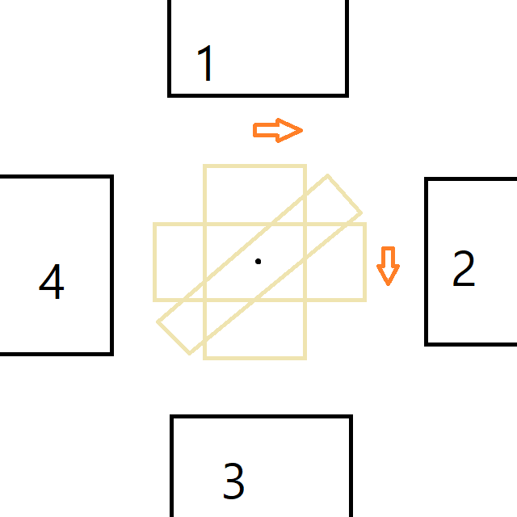
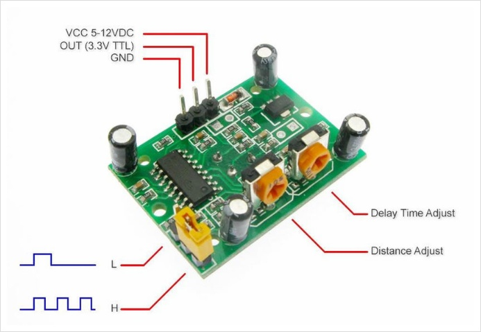

- 코드 : [RTC](./rtc.ino)
- 코드 : [Stepmotor - 가변저항을 이용한 회전수 제어](./stepmotor.ino)
- 코드 : [Bluetooth - 블루투스의 데이터 통신을 통한 LED 제어](./bluetooth.ino)
---
---
# RTC(Real Time Clock) 모듈 DS1302

## 동작원리

- 실제 시간을 기록해 두었다가, 필요시 읽을 수 있도록 현재 시간을 유지하는 역할을 한다
- 옆에 달린 배터리는 DS1302칩이 시간을 계속 카운트 할 수 있도록 전원 공급 역할을 한다
- 배터리 수명이 끝나거나, 모듈에서 분리될 경우 DS1302칩에 기록된 시간은 초기화되니 주의해야 한다

## 핀 구조

- 핀은 VCC, GND, CLK, DAT, RST 총 5개로 구성되어 있다.
- VCC, GND는 전원을, 나머지 3개는 데이터 송수신 및 시간 조절을 위해 사용된다
- 해당 핀을 이용해 통신하는 방식을 SPI(Serial Peripheral Interface) 통신 인터페이스라고 부르며, SPI의 3-Wire 방식을 채용하고 있다

- 추가 정리 : [아두이노의 통신 방법](./아두이노의_통신_방법_2020-09-24.md)

## 예제

- http://www.rinkydinkelectronics.com/library.php?id=5
- 예제에 사용한 라이브러리
- 라이브러리 종류에 따라 다른 예제들이 많으니 주의 할 것

```arduino
#include <DS1302.h>
DS1302 rtc(10, 9, 8); // RST, DAT, CLK

// setup
rtc.setDOW(THURSDAY); // 요일 설정
rtc.setTime(10, 27, 50); // 시, 분, 초 시간 설정
rtc.setDate(24, 9, 2020); // 일, 월, 년 날짜 설정

// loop
// 요일 출력은 getDOWStr() -> Thursday
// 날짜 출력은 getDateStr() -> 24.09.2020
// 시간 출력은 getTimeStr() -> 10:27:50
```

- 다른 형태의 예제

[https://javalab.org/aduino_ds1302_test/](https://javalab.org/aduino_ds1302_test/)

[https://juahnpop.tistory.com/56](https://juahnpop.tistory.com/56)

[https://blog.naver.com/chandong83/221451714944](https://blog.naver.com/chandong83/221451714944)

# 스텝모터(28BYJ-48 & ULN2003)

## 작동 원리

- 모터의 회전을 잘게 쪼개서 쪼긴 조각을 이용해 제어하는 모터
- 펄스에 의해 디지털적으로 제어하기 때문에 정밀한 제어가 가능하다



- 스텝모터는 회전자(로터)와 4방향의 고정자(스테이터)로 구성되어있다
- 스텝모터를 구동하려면 사용하려는 모터가 몇 상 모터인지(전자석이 몇개인지)? 어떤 여자 방식을 이용하여 동작시킬 것인지 고려해야 한다
- 4개의 전자석을 각각 하나씩 전류를 흘리면 전자석이 S극의 성질을 띄게 되어, 중심의 회전자의 N극이 전류가 들어온 전자석 방향으로 회전하게 한다.
- 1번 전자석에 전류를 흘리면, 회전자가 1번을 향해 움직인다
- 1번 전자석에 들어오는 전류가 없어지고 2번 전자석에 전류를 흘리면 회전자가 2번을 향해 움직인다.
- 이런식으로 1→2→3→4로 회전하면 시계방향으로 회전하고, 4→3→2→1로 회전하면 반시계방향으로 회전하게 된다
- 예를 들어, 스텝 각이 1.8도인 모터에 펄스를 100개 인가하면 모터는 180도 회전하게 된다. (200펄스 → 360도)
- 이렇게 한번에 전자석 하나에만 전류를 공급하는 것을 싱글 코일 여자방식(Single-coil Excitation)이라고 한다. 그 외에도 2상 여자 방식, 1-2상 여자 방식이 있다.

## 스텝모터의 분류

- 스텝모터는 작동 방식에 따라 두가지로 구분된다
- 유니폴라 방식은 권선에 전류를 한쪽 방향으로만 흘리는 방식으로 큰 토크(힘)가 나오지 않지만 탈조 위험이 낮고 고속 회전이 가능하다는 장접이 있다
- 바이폴라 방식은 권선에 전류의 방향을 바꿔서 모터를 구동하는 방식으로 회로구성이 복잡하지만 저속에서 토크 성능이 좋고 유니폴라 방식에 비해 높은 정밀도를 가진다는 장점이 있다

## 핀 구조

- 실습에 사용한 스텝모터는 유니폴라 방식 전용의 28BYJ-48 스텝모터로, 모터 드라이버와 함께 구성되어 있다. 모터는 모터 드라이버에 연결하고, 모터 드라이버에서 6개의 핀을 사용한다
- 전류를 흐르게 하는 VCC와 GND가 있고,  나머지 4개는 4개의 전자석을 컨트롤 하는 역할을 한다

## 예제

```arduino
#include <Stepper.h> // 스텝 모터 라이브러리 정의
int stepRotation = 2048; // 한바퀴(360) 스텝 수, 반 바퀴(180)는 1024
int IN1, IN2, IN3, IN4; // 핀 번호 지정
Stepper myStepper(stepRotation, IN4, IN2, IN3, IN1); // 들어가는 순서 주의

// setup
stepper.setSpeed(10); // 스텝모터의 스피드 설정(rpm)

// loop
myStepper.step(stepRotation); // 정방향 1바퀴
myStepper.step(-stepRotation); // 역방향 1바퀴
```

# 적외선 PIR센서(인체감지 모션센서)

## 작동원리

- 적외선을 통해 사람의 움직임(motion)을 감지하는 센서
- 사람의 몸에서 방사되는 적외선을 센싱하여 감지범위 안에 적외선의 변화가 있을 시 HIGH를 출력

## 핀 구조



- 뒤집어서 가변저항을 밑으로 놓고 보면 위에 핀이 3개가 보이는데, 왼쪽부터 GND, OUTPUT, VCC 핀이다.
- 왼쪽 아래는 Jumper Set으로, 아래 2개가 연결되면 single 트리거, 위로 2개가 연결되면 repeat 트리거 상태가 된다.
- single 트리거 - 센서 출력이 HIGH가 되고, 딜레이 타임이 끝나면 자동적으로 LOW가 된다
- repeat 트리거 - 센서 출력이 HIGH가 되고, 딜레이 타임이 끝나도 만약 계속 인체 신호가 감시된다면 LOW를 출력하지 않고 계속 HIGH를 출력한다
- 아래의 가변저항은 왼쪽부터 차례로 센서의 민감도, 센서의 딜레이 시간을 조절할 수 있다

## 예제

```arduino
int PID; // OUT 핀 설정
int LED; // 판별을 위한 LED VCC핀 설정

// setup
pinMode(PID, INPUT);   // 핀의 값을 받기 위해 INPUT으로
pinMode(LED, OUTPUT);

// loop
val = digitalRead(PID); // 디지털로 값을 받음. 인식 시 HIGH 출력
if(val == HIGH) digitalWrite(LED, HIGH);
else digitalWrite(LED, LOW);
delay(100);
```

# 조도센서

## 작동원리

- 주변 환경의 밝기를 측정하는 센서
- 빛을 받으면 내부에 움직이는 전자가 발생해 전도율이 변하는 광전효과를 가지는 소자를 이용한다
- 황화카드뮴(Cds)을 소자로 사용하여 Cds센서라고 부르기도 한다
- 보통 조도를 측정하는 단위로 룩스(Lux)를 많이 사용하지만, 해당 센서는 정확히 조도수치를 보여주지는 않을뿐더러, 직선비례하지 않습니다. 그러므로 상대적으로 어둡다/밝다 정도를 판단하는 용도로 사용합니다.

## 핀 구조


- Cds센서는 센서라기보다, 극성이 존재하지 않는 가변저항이다
- 극이 존재하지 않고, 두개의 핀만 존재한다
- 한쪽 핀에 GCC를 10K 저항을 거쳐서 연결하고, 반대쪽 핀에 GND를 연결한다. 그리고 10K 저항과 Cds센서 사이에 점프선으로 INPUT 선을 추가로 연결한다
- 이와 같은 형태의 연결을 풀업 연결이라고 한다
- 이때, INPUT은 아날로그로 받으므로 아두이노의 아날로그핀에 연결한다

## 예제

```arduino
#define cdsPin A0

// setup
Serial.begin(9600);

// loop
int value = analogRead(cdsPin); // 조도값을 아날로그로 받음
Serial.println(value);
delay(500);
```

# 블루투스(Bluetooth) HC-06

## 작동 원리

- 근거리 무선 통신 기술 중 하나
- 근거리에서 기기간 통신선 연결 없이 무선으로 데이터를 교환 하는 기술
- 우리가 휴대폰이나 노트북으로 사용하는 '그 기술'이 맞다

## 핀 구조

- VCC, GND, RX, TX의 4개의 핀을 가지고 있다.
- VCC, GND는 5v와 0v에 연결하고, RX, TX는 시리얼 통신을 하기 윈한 핀입니다
- 이 경우, 아두이노에서 시리얼에 사용하는 기본 핀 외에 다른 디지털 핀으로 시리얼 통신을 하기 위해 Softeware Serial을 사용합니다
- 추가 정리 : [아두이노의 통신 방법](./아두이노의_통신_방법_2020-09-24.md)

## 예제

```arduino
#include <SoftwareSerial.h> // SoftwareSerial을 사용하기 위한 라이브러리

int bt_rxd, bt_txd; // 블루투스와의 통신을 위한 rx, tx핀
SoftwareSerial bluetooth(bt_txd, bt_rxd); // SoftwareSerial 객체 생성

// setup
Serial.begin(9600); // 기본 시리얼
bluetooth.begin(9600); // SoftwareSerial로 가져온 블루투스 시리얼

// loop
if(bluetooth.available()) Serial.write(bluetooth.read());
if(Serial.available()) bluetooth.write(Serial.read());
// 데이터 입력 시 읽어온다. SoftwareSerial의 사용법은 기본 시리얼과 거의 동일하다
```

## AT Command

- 휴대폰과 통신하기에 앞서 블루투스를 AT 명령어를 통해 세팅해야 한다
- 우선, 시리얼 모니터를 열먼 블루투스에 맞게 텍스트 입력 형태를 'line ending 없음', 속도를 '9600baud'으로 바꿔줍니다
- AT → 통신 테스트. 성공시 OK 반환
- AT+BAUDn → 통신속도 변경. n에 들어갈 숫자에 해당하는 통신 속도는 아래와 같다. 기본값은 4-9600baud.

|AT+Baud|통신속도|
|---|---|
|1|1200|
|2|2400|
|3|4800|
|4|9600|
|5|19200|
|6|38400|
|7|57600|
|8|115200|

- 아두이노의 SoftwareSerial 라이브러리가 57600baud 이상은 지원하지 못한다는 한계가 있으므로 적절한 속도를 선택해야 한다
- AT+NAMEname → 장치의 이름을 name으로 바꾼다
- AT+PINxxxx → 장치의 페어링 비밀번호를 xxxx으로 변경. 기본값은 1234

## 휴대폰 연결

- 설정을 마치고, AT로 연결이 확인이 되었다면 휴대폰에서 블루투스 설정에 들어가 검색을 하면 뜹니다
- 아두이노와 데이터를 주고받기 위해서 구글 플레이스토어에서 'BT Chat 아두이노 블루투스 채팅'을 사용했습니다
- 해당 어플을 통하여 데이터를 보내면 시리얼을 통해 확인이 가능합니다. 반대의 경우도 가능합니다.