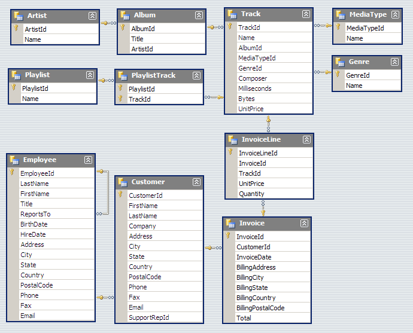
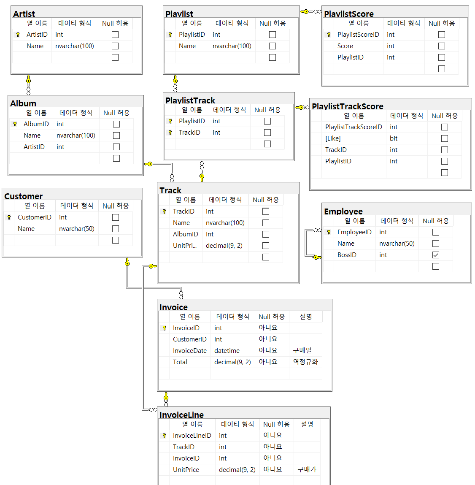

# Chinook Database Sample



- 데이터베이스 설계 예제로, MP3 판매 관리에 대한 데이터베이스이다

## 테이블의 생성

- 테이블을 생성할 때는 가장 간단한것부터 생성한다
- 기본키는 고유 번호를 매기는 것이 가장 좋은 방법이다
- 고유번호의 열 이름은 "테이블명+ID"로 하고, 형식은 int가 제일 무난하다

---

- 테이블을 설계하고 생성하다보면, 하나의 테이블을 이름만 다르게 여러개 만드는 경우가 생길 수 있다.
- 두 테이블이 ```1:1```관계가 성립하는 경우가 생긴다면, 두 테이블은 로직상 같은 역할을 하는 하나의 테이블일 확률이 매우 높다

---

## 관계

- 테이블간의 관계는 대부분 ```1:n``` 또는 ```n:n```의 관계를 가진다. 특수한 경우에는 ```1:1``` 관계도 있다
- ```1:n```의 경우, ```n```인 테이블에 ```1```의 데이터(고유번호 등)가 들어간다
- 한 가수가 여러 앨볌을 내는 상황만 존재한다고 가정했을 때, Artist가 ```1```이고 Album이 ```n```인 관계가 되고, ```1```인 Artist의 기본 키를 ```n```인 Album에 외래 키로 지정해준다.

---

- ```n:n```의 경우, 하나의 ```n:n```관계를 ```1:n```으로 정리할 수 있는 **맵핑 테이블**을 만들어준다.
- Playlist와 Track의 경우, Playlist에 여러 곡이 들어갈 수 있고, Track도 여러 플레이리스트가 속할 수 있으므로, 둘을 정리해 줄 수 있는 PlaylistTrack이라는 맵핑 테이블을 만들어 준다.
- 맵핑 테이블에는 두 테이블의 고유 번호가 각각 들어가고, 각각의 고유 번호를 외래 키로 지정해준다. 그리고 두 고유 번호 값을 같이 다중 기본 키로 설정해준다

---

- ```1:n```의 관계 중, ```1```인 테이블이 다중 기본키를 가지고 있다면, ```n```은 다중 외래키를 만들어 관계를 연결해주어야 한다

---

## Master-Detail 패턴

- 우리가 주문을 할 때 상품을 하나 살 수도 여러개를 살 수도 있는데, 그렇다면 주문 테이블을 어떻게 구성해야 할까?
- 주문 테이블에 각각의 제품을 나타내는 열을 Track1, Track2, ... 처럼 구성한다면, 당장은 문제가 없겠지만 이후에 분명히 여러 상품을 구매할 떄 문제가 나타날 수 있고, 코드의 구성 또한 비효율적이게 된다.
- 그래서 주문의 상품내역을 부가적인 Detail 항목으로 나타내는 것을 Master-Detail 패턴이라고 부른다
- Invoice 항목에 여러 상품 구매를 Track1, Track2, ... 처럼 구현하게 되면, 코드 단에서 if문을 반복 사용하게 되어 비효율적이고, 문제가 생길 가능성이 커서 Invoice의 세부항목(상품내역)을 나타내는 InvoiceLine 테이블을 따로 생성하여 사용한다
- 여기서 InvoiceLine 테이블이 Detail에 해당하고, InvoiceLine 테이블은 거래정보(InvoiceID), 상품정보(TrackID)와 판매자 가격 등의 열이 있다

---

## 계산된 컬럼

- 이미 있는 값들을 계산한 값을 저장하는 열을 계산된 컬럼이라고 한다
- 하지만, 이는 값들이 이미 존재하는 상황에서 열을 생성한 것이기 때문에 정규화에 위배되는 역정규화라고 부른다
- 그럼에도 계산된 컬럼을 사용하는 이유는, 필요의 이유 또는 성능상의 이유가 있다
- Invoice 테이블의 Total 열은 이미 있는 값을 다시 사용하는 것이므로, 정규화에 맞지 않지만 매번 카운트하기에 부하가 걸려 성능상 문제가 생길 수 있어 역정규화로 Total 열을 사용하는 것이다.

---

## 트랜잭션

- All or Nothing
- 계산된 컬럼을 사용할 때, 계산된 컬럼에 해당하는 컬럼의 값이 추가되거나 삭제되는 상황이 생기면 계산된 컬럼의 값도 변화해야 한다. 하지만 계산된 컬럼의 값이 수정되기 전에 서버가 다운되면 계산된 컬럼의 값이 맞지 않아 문제가 생길 수 있다.
- 이 때 트랜잭션은, "해당 컬럼에 값이 추가 또는 삭제" 될 때 "해당 값들의 합을 나타낸 컬럼의 값도 변화한다"는 두가지 행동을 하나로 묶는 것을 의미한다
- "해당 컬럼에 값이 추가 또는 삭제" 될 떄, 합을 나타내는 칼럼의 값이 변화하기 전에 서버가 다운되는 등의 상황이 발생하면, 이전 명령도 작동하지 않게 된다.
- InvoiceLine 테이블에 값이 추가될 때 Invoice 테이블의 Total열의 값도 변화해야 하는 두가지 행동을 하나로 묶는 것을 트랜잭션이라고 하며, 트랜잭션이 없는 상태에서 중도에 서버가 다운되면 Invoice 테이블의 Total열의 값이 맞지 않아 문제가 생길 수 있다

---

