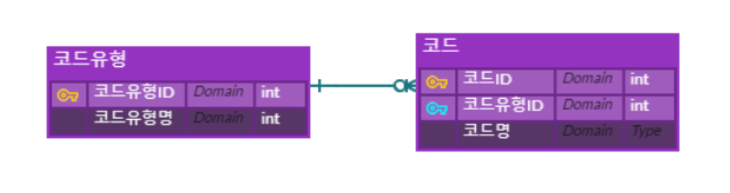
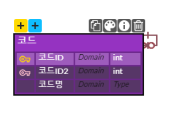

# 코드 테이블

- 코드성 테이블, 룩업(Lookup) 테이블이라고도 한다
- 카테고리로 분류될 수 있는 정보들을 담고 있는 테이블. 'Key-Value' 구조로 저장되어 있다.
- 코드 테이블에 저장 되어 있는 Key값은 다른 테이블에 의해 사용된다.

## 장점

- 데이터가 차지하는 용량을 줄일 수 있다 : 직접 데이터를 계속 입력하는 것 보다, 대체된 Key값을 입력하여 효율적이다
- 성능의 향상 : 위의 이유처럼, 메모리를 읽는 용량과 처리량이 작아진다
- 데이터의 집중화 : 모든 테이블과 컬럼은 특정 '값'을 참조한다. 모든 테이블이 '서울'이라는 내용을 city 칼럼에 넣는다고 할때, '서울'도 '서울특별시'도 모두 일관적으로 'seoul'로 표시한다는 점이다
- 데이터 수집의 유연성 : 만약 코드 테이블이 존재하지 않는 상태에서 'seoul'로 표기된 값을 모두 '서울'로 변경하려면 많은 연산이 필요하다. 그러나 코드 테이블만 있다면 한 줄만 수정하면 된다
- 빠른 응답 및 스캔 : 해당 테이블에서 주로 사용되는 값이 무엇인지 확인하려면 코드 테이블만 확인하면 된다
- Value뿐만 아니라, 관련된 데이터도 유지보수가 쉽다 : 코드 테이블을 통해 단순 Value(서울)의 개념을 구현할 수도 있지만, 해당 데이터의 다른 데이터(서울의 풀 네임, 서울의 지역코드 등)들도 저장할 수 있다.

## 단점

- 이렇듯 코드 테이블의 사용은 분명 권장된다. 하지만 코드 테이블이 많아지면 해당 테이블 마다 데이터의 입력 및 수정, 삭제 등을 위한 리소스가 필요해지고, 이는 효율성의 감소로 이어질 수 있다

# 공통 코드 테이블

- 거의 모든 시스템에서 업무에서 사용하는 모든 코드 테이블을 공통코드 테이블에서 통합하여 관리하는 것이 일반적이다

## 2단 코드 테이블



- 코드유형 테이블

|코드유형ID|코드유형명|
|---|---|
|1|장르|
|2|카테고리|

- 코드 테이블

|코드ID|코드유형ID|코드명|
|---|---|---|
|1|1|뮤지컬|
|2|1|코미디|
|3|1|스릴러|
|4|2|영화|
|5|2|드라마|
|6|2|예능|

- 코드 식별자를 ```코드유형ID+코드```형태로 사용하는 방법도 있다. 이렇게 관리하면 코드에 대한 코드유형ID의 조건 없이 코딩이 가능해지므로 생산성이 좀 더 좋아지며, 코드ID만 보고 어떤 코드유형인지 확인이 가능해진다

|코드ID|코드유형ID|코드명|
|---|---|---|
|1001|1|뮤지컬|
|1002|1|코미디|
|1003|1|스릴러|
|2001|2|영화|
|2002|2|드라마|
|2003|2|예능|

## 1단 코드 테이블



- 코드유형과 코드를 하나로 합쳐 순환 관계로 관리하는 형태도 있으며, 테이블 형태만 다를 뿐 크게 다르지 않다

|코드ID|상위코드ID|코드명|
|---|---|---|
|10||장르|
|1001|10|뮤지컬|
|1002|10|코미디|
|1003|10|스릴러|
|20||카테고리|
|2001|20|영화|
|2002|20|드라마|
|2003|20|예능|

## 출처

- 음냐 - [공통코드 설계](https://blog.naver.com/new_magma/20156422595)

- B2EN - [공통코드 어떻게 설계하나?](https://blog.b2en.com/366)

- 전진 - [실전 DW 설계 - 공통 코드 테이블(Code Table)설계](http://blog.daum.net/hadmond/12)

# 데이터베이스 언어

- 데이터베이스 언어 SQL 문법의 종류는 다음 세 가지로 대별된다
- Data Definition Language - 데이터 정의어
    - 데이터 구조의 생성, 업데이트, 삭제를 위한 언어
- Data Manipulation Language - 데이터 조작어
    - 대상 데이터의 검색, 등록, 업데이트 및 삭제를 위한 언어
    - CRUD / Create, Read, Update, Delete
    - select, Insert, update, delete
- Data Control Language - 데이터 제어 언어(Data Access Language)
    - 엑세스 제어를 위한 언어

# SELECT 구문

```sql
--SELECT 구문 형식(출처 : 이것이 SQL Server다)
[ WITH <common_table_expression>]
SELECT select_list [INTO new_table]
[ FROM table_source ]
[ WHERE search_condition ]
[ GROUP BY group_by_expression ]
[ HAVING search_condition ]
[ ORDER BY order_expression [ ASC | DESC ] ]
```

## SELECT와 FROM

```sql
-- USE [데이터베이스 이름]
-- SELECT [열 목록] FROM [테이블]
use Chinook
select * from Employee
```

- use : 해당 데이터베이스를 사용한다
- select 열 목록 from 테이블 : 해당 테이블의 해당 열을 출력한다. *는 모든 열을 출력한다는 의미이다.
- -- : 한줄 주석, /**/ : 여러줄 주석

## 기본적인 WHERE절

```sql
-- SELECT [열 목록] FROM [테이블] WHERE [조건]
select * from Employee where EmployeeId % 2 = 0
select * from Employee where BirthDate < '1970-1-1' and EmployeeId > 3
select * from Employee where EmployeeId between 2 and 5
select * from Employee where EmployeeId not in (3, 6, 9)
```

- where : 조건에 따라 해당 내용을 출력한다
- A = B : SQL문에서는 'A 와 B는 같다'의 의미이다
- A and B : SQL문에서는 'A 그리고 B'의 의미이다
- A between B : SQL문에서는 'A 부터 B', 'A이상 B이하'의 의미이다
- in (A, B, C) : SQL문에서는 'A와 B와 C'의 의미이다
- not : SQL문에서는 '~이 아닌'의 의미이다

```sql
select * from Employee where ReportsTo is NULL
select * from Employee order by ReportsTo desc, LastName asc
select top 3 * from Employee
```

- is null : SQL문에서 null값의 여부를 판단할때는 '=' 대신 'is null'을 사용한다. 반대의 의미는 'not null'
- 참고로 null값은 n보다 작은 값 등으로 조건을 줄 경우 출력되지 않는다. 즉, null은 **값**으로 취급되지 않는다.
- order by A [asc/desc] : 테이블을 A를 기준으로 정렬하여 출력
- asc/desc : 오름차순/내림차순 정렬을 의미. 사용하지 않으면 asc로 취급
- top N : 상위 N개만 출력

## GROUP BY

```sql
select ReportsTo from Employee group by ReportsTo

select ReportsTo, count(*) from Employee
where EmployeeId % 2 = 0 -- 그룹핑 전 필터
group by ReportsTo
having ReportsTo < 5 -- 그룹핑 후 필터
```

- group by A : A열을 그룹핑 하여 출력
- group by 문을 사용하면, 해당 열의 **존재하는 값**을 **중복값 제외**하고 출력한다
- A라는 열에 값이 1,1,1,2,3,5,3,2,2,3,2,3,2,4,2,3,2,4,5,5,2,1,2,3가 있다면, A열을 group by 하여 A열을 출력하면 1,2,3,5,4가 출력된다
- A라는 열을 그룹핑 하게 되면 논리적으로 다른 열을 출력할 수 없게 된다. select 뒤에 다른 열을 출력하려고 하면 에러가 난다. 대신 그룹핑 한 A 열과, 집계함수를 사용하는 것은 가능하다.
- having : 그룹핑 이후 필터링을 한다. 그룹핑 이후 필터링이기 때문에 논리적으로 그룹핑으로 선택한 해당 열만 조건으로 사용할 수 있게 된다. 그래서 그룹핑 한 열을 제외한 다른 열의 조건을 사용하려면 그룹핑 이전에 where문을 사용해야 한다.
- 대표적인 집계함수

|함수명|설명|
|---|---|
|avg()|평균값|
|min()|최소값|
|max()|최대값|
|count()|행의개수|
|count_big()|개수를 센다. 단, 결과값이 bigint형|
|stdev()|표준편차|

## JOIN

- 두 개 이상의 테이블을 서로 묶어서 하나의 결과집함으로 만들어 내는 것
- 데이터의 관계에 따라 생성되있는 테이블들의 값을 합쳐 유의미한 데이터 결과를 만들어내기 위해 사용한다

```sql
-- join [조인할 테이블] on [조건]
select * from Album
join Artist on Album.ArtistId = Artist.ArtistId
```

- Album 테이블과 Artist 테이블을 조인해서, Album의 ArtistId값과 Artist의 ArtistId값이 같은 값들을 출력한다는 의미이다.
- 가장 많이 사용되는 조인의 형태로, Inner Join이라고 부른다.

```sql
-- from [테이블명] as [약칭] / [테이블명] [약칭]
select al.AlbumId, al.Title, ar.Name from Album as al
join Artist ar on al.ArtistId = ar.ArtistId
```

- join한 후에 select에서 원하는 열만 추려서 출력할 수 있다. 저렇게 출력하면, 우리가 원하는 유의미한 데이터(가수의 이름과 노래의 제목이 같이 출력)를 구할 수 있다
- as를 사용하면 테이블명 또는 열 이름의 약칭을 지정해 사용할 수 있다. as를 사용하지 않고 바로 약칭을 지정할 수도 있다

```sql
select top 5 r.Name Artist, a.Title Album, t.Name Track from Track t
join Album a on t.AlbumId = a.AlbumId
join Artist r on a.ArtistId = r.ArtistId
```

- 테이블 간의 관계를 잘 고려하면, 3개의 테이블을 조인할 수 있다
- 위 쿼리는 Track에 AlbumId와 Album에 AlbumId의 관계와, Album의 ArtistId와 Artist의 ArtistId관계를 이용해 조인한 것이다

```sql
select * from Album left join Artist on Album.ArtistId = Artist.ArtistId
```

- 외부조인(Outer Join)은 해당 기준 테이블에서 조건이 만족되지 않는 행의 데이터도 출력하는 것이다
- left join은 왼쪽 from에 쓴 테이블을 기준으로 외부조인을 한다. 반대로 right는 오른쪽 join뒤에 쓴 테이블을 기준으로 외부조인을 한다. 그래서 보통은 left join을 쓰고 테이블 명을 옮긴다
- 보통 매칭되는 값이 없거나 null값이 없이 설계되었다면, 외부조인의 값은 내부조인과 다를 바 없다. 그래서 특수한 경우가 아니면 잘 쓰이지 않는다
- 이 외에 상호조인(Cross Join), 자체조인(Self Join)이 있지만, 거의 쓰이지 않는다

## UNION

```sql
select * from Artist where ArtistId < 3
union -- (all/except)
select * from Artist where ArtistId between 2 and 5
```

- 두 쿼리의 결과를 행으로 합치는 것을 의미한다. 중복값은 사라진다(합집합)
- ALL을 사용하면 중복값을 허용한다
- EXCEPT는 두 번째 쿼리에 해당하는 값을 제외한다(차집합)
- INTERSECT는 EXCEPT와 반대로 두 번쨰 쿼리에 해당하는 값만 조회한다