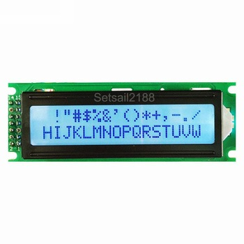
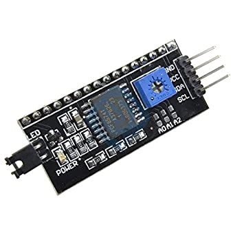

- 코드 : [BuzzerPiano - 부저를 이용한 음악 연주](./BuzzerPiano.ino)
- 코드 :[LCDmultiplication - LCD에 구구단 출력](./LCDmultiplication.ino)
- 코드 : [Distance+Buzzer - 초음파 거리 측정기에서 측정된 거리에 따른 부저음 출력](./Distance+Buzzer.ino)
---
---
# 습도센서모듈(DHT Sensor/DHT11)

## 라이브러리 추가

- 모듈(센서)을 사용하기 위해서 라이브러리의 추가가 필요하다
- 라이브러리가 없을 경우, '스케치 → 라이브러리 포함하기 → 라이브러리 관리' 메뉴를 통해 필요한 라이브러리를 다운받아 작업할 수 있다
- 라이브러리를 다운받은 후 '스케치 → 라이브러리 포함하기'를 통해 포함하거나, 직접 #include를 작성해 헤더파일을 추가하면 된다

## 습도센서의 동작 원리

- 정전 용량을 감지하는 방식과 저항 감지형이 있다
- 정전 용량을 가밎하는 방식은 정밀도가 높지만 가격이 비싸 DHT11에서는 사용하지 않는다
- 저항 감지형을 보면, 센서 안에 두 전극이 서로 연결이 되어있지 않지만 공기 중의 수분을 통해 미세하게나마 전류가 흐를 수 있게 된다. 이에 따라서 공기중의 습도에 따라 변화하는 저항값으로 습도를 측정하게 된다

## 온도센서의 동작원리

- 물질의 저항 값이 온도에 따라 변화되는 성질을 이용한다
- 이를 이용한 써미스터라 불리는 온도 센서가 DHT11에 들어있다

## 핀 구조

- 모듈에서 보았을 때 S가 그려진 곳과 가까운 곳이 DHT(OUT)핀, ' - '가 그려진 곳과 가까운 곳이 GND핀, 나머지 한개가 VCC핀이다

## 예제

```arduino
#include <DHT.h> // 라이브러리 추가

#define DHTTYPE DHT11 // DHT타입을 11로 선택한다
int VCCPin, GNDPin, DHTPin // 연결한 핀번호를 설정

DHT dht(DHTPin, DHTTYPE); // DHT 객체 선언

// ... 기본 설정(pinMode) 및 VCC와 GND에 HIGH, LOW 설정

float fTemp = dht.readTemperature(); // 온도를 측정합니다
float fHumi = dht.readHumidity(); // 습도를 축정합니다
// 실패시 nan(not a number) 출력

if(isnan(fTemp)||isnan(fHumi)){...} // 측정 실패 예외처리 (isnan - nan을 측정하는 함수)

// 이후 출력시 온도는 C 단위로, 습도는 % 단위로 출력된다
```

# 사운드 센서

## 동작 원리

- 주변에서 발생되는 소리를 마이크로 모아, 소리의 크기를 증폭시켜 출력한다. 원하는 소리가 잘 감지되지 않을 경우, 가변저항을 통해 감도를 조절할 수 있다

## 핀 구조

- 3핀의 경우 아날로그로, 4핀의 경우 아날로그와 디지털 둘 다 측정이 가능하다. 4핀의 경우, A0이 아날로그 OUT, G가 GND, +가 VCC, D0이 디지털 OUT을 의미한다
- 아날로그 값의 경우는 소리의 미세한 값을 숫자로 나타내고, 디지털 값의 경우 소리의 여부를 HIGH, LOW로 나타낸다

## 예제

```arduino
int sensor; // 아날로그 핀(A0)이 연결된 핀을 저장한다

// Setup
pinMode(sensor, INPUT); // 센서를 입력으로 사용하기 위해 설정

// Loop
int val = analogRead(sensor); // 아날로그 신호를 받기 위해 alalogRead 사용

// 이후, val을 출력하면 숫자로 값이 출력된다
```

# LCD 디스플레이 모듈

## 핀 구조



> ↑ LCD(16x2), ↓ I2C LCD Interface Converter

- LCD의 핀은 16게로, 전원 공급과 데이터 읽기/쓰기, 대비 및 백라이트 옵션 등 다양한 기능이 있다
- 핀을 너무 많이 차지하므로, LCD Interface Converter(I2C LCD Converter)를 사용하면 I2C 인터페이스를 사용해서 LCD를 제어하게 해주며, 4개 핀으로 LCD를 조작할 수 있다.
- 4개의 핀은 VCC, GND, SCL, SDA이다
- SCL, SDA 핀은 통신에 사용하는 핀으로, I2C라는 통신표준을 사용해 통신하는 핀이다.
- 명암 조절은 LCD Interface Converter의 가변저항을 이용해 조절할 수 있다. (사진의 파란부분을 돌리면 된다)

## I2C (Inter-Integrated Circuit)

- 시그널 핀 2개를 이용해 여러 장치들과 통신하게 해주는 통신표준
- 클럭 시그널을 전송하는 SCL핀과 데이터 전송을 위한 SDA핀을 사용한다
- 데이터 전송을 위해 하나의 연결만 사용하므로, 데이터는 한번에 한 방향으로만 전송된다. 양방향으로 전송을 할 경우 속도가 느려지는 단점이 있다.
- 아두이노가 마스터가 되고 다른 모듈들이 슬레이브가 된다. 슬레이브들은 고유의 식별ID를 가지고 있으며, 이를 통하여 원하는 모듈에 데이터를 전송한다
- 아두이노 UNO에서는 I2C용으로 A4번, A5번핀에 SDA, SCL이 예약되어 있다. Mega보드에는 Digital20번, Digital21번 핀에 예약되어 있다.
- 보통 I2C를 지원하는 디바이스는 VCC, GND, SDA, SCL 4개의 핀을 가지고있다.
- I2C 통신을 위해서는 전용 라이브러리가 필요하다. #include <Wire.h>를 선언함으로써 사용할 수 있으며, 표준 스트림 클래스를 상속하므로 read(), wirte(), print()등의 함수명을 사용할 수 있다.

## 가변저항

- 사용자의 조절로 값이 변하는 저항을 뜻한다
- 오디오의 볼륨을 제어하거나 LED 조명의 밝기를 제어하는 등의 아날로그 신호를 표현하기 위해 사용한다
- 가변 저항은 vcc, gnd, wiper라는 세게의 단자가 있으며, wiper는 가변저항의 변경된 저항 값을 읽을 수 있는 단자이다

## 라이브러리

- Wire : I2C 통신을 위한 라이브러리
- LiquidCrystal_I2C : LCD Interface Converter를 통해 I2C로 통신하는 LCD 사용을 위한 라이브러리
- LCD 사용을 위한 기본적인 LiquidCrystal 라이브러리도 존재. 이번 예제는 LCD에 LCD Interface Converter를 연결한 상태로 실습하기 때문에 위의 라이브러리를 사용해 실습함.

## 예제

```arduino
#include <Wire.h>
#include <LiquidCrystal_I2C.h> // 라이브러리
LiquidCrystal_I2C lcd(0x27, 16, 2); // LCD 객체 선언

// setup
lcd.init();
lcd.backlignt(); // 백라이트 on
lcd.clear(); // LCD 내용 삭제
lcd.setCursor(0, 1); // 커서를 이동(0번째 1번라인)
lcd.print("Hello, world!"); // 문자열 출력
```

## LiquidCrystal_I2C lcd()

```arduino
LiquidCrystal_I2C lcd(0x27, 16, 2);
```

- LCD 설정(LiquidCrystal_I2C lcd()) 첫번째 인자는 I2C 주소로, 해당 모듈에서 사용하는 주소는 0x20, 0x27, 0x3F가 있다.
- 두번째 인자와 세번째 인자는 가로, 세로 크기를 나타낸다.

# 피에조 부저

## 동작원리

- 전원을 입력할 경우 삐- 소리가 난다
- tone() 함수를 이용해 주파수를 조절해 여러 음을 낼 수 있다
- 전자 피아노나 게임 음 소리, 음악 연주 및 음을 내는 전자제품에 사용된다

## 핀 구조

- 2개가 있다. 긴 쪽이 VCC, 짧은 쪽이 GND이다
- 보통 짧은 쪽은 GND에, 긴 쪽은 디지털 단자에 연결해 제어한다

## 예제

```arduino
int buzzerPin; // 부저의 VCC핀, GND는 GND에 연결
int fData[] = {130, 147, 165, 174, 196, 220, 247, 261}; // 음계별 주파수 정보를 저장한다. 3옥 3ㅗ에서 4옥 도까지 입력했다.

// setup
pinMode(buzzerPin, OUTPUT);

// loop
for(int i =0; i < 8; i++)
{
	tone(buzzerPin, fData[i]); // 부저에 음을 출력한다
	delay(1000);
	noTone(buzzerPin); // 음을 끈다
}
```

## tone(), noTone()

```arduino
(void)tone(pin, frequency);
(void)tone(pin, frequency, duration);
```

- 피에조 버저 또는 스피커에 연결된 핀에 특정 주파수의 구형파를 발생시켜 연주가 가능하다.
- 한번에 한 톤만 발생시킬 수 있다. 다른 핀에서 tone을 불러도 아무일도 일어나지 않는다. 다른 핀에서 tone을 부르기 전에 noTone을 불러야 한다
- tone 함수를 사용할 경우 3번 핀과 11번 핀이 간섭을 받아 analogWrite() 함수를 사용할 수 없게 된다. (Mega 제외)
- pin : tone을 발생시킬 핀
- frequency : tone의 주파수(Hz) - unsigned int
- duration : tone의 지속 시간(ms) - unsigned long
- duration을 지정하면, 지정된 시간 만큼만 작동하고 구형파의 발생을 멈춘다

```arduino
(void)noTone(pin);
```

- tone()에 의해 시작된 구형파의 발생을 멈춘다.
- pin : tone 생성을 멈출 핀

## tone(pin, frequency, duration) 사용의 주의점

- 우리는 tone(pin, frequency, duration)을 사용하여 500ms 간격으로 버저가 켜졌다 꺼졌다 하게 하고 싶다.

```arduino
// loop
tone(pin, fre, 500);
delay(500);
```

- tone에 duration을 지정해주면 tone은 버저 모듈을 불러 duration동안 작동하도록 명령할 것이다.
- 그런데 이 경우, delay가 발생하기 전에 duration동안 계속 버저가 켜지는 것이 아니라, 모듈에 명령을 입력하고 프로세스는 계속 돌아간다는 것이다.
- 즉, 버저가 켜져있는 상태로 loop가 돌아간다.
- 버저가 꺼질 때 쯤 delay도 끝나 loop를 돌아 다시 tone을 실행하게 되고, tone은 다시 명령을 내리게 된다
- 결과적으로, 해당 코드를 실행하면 버저가 마치 계속 켜져있는 것처럼 들리게 된다

```arduino
// loop
tone(pin, fre, 500);
delay(1000);
```

- 그러므로, 버저가 켜졌다 꺼졌다 하게 하려면 tone에서 지정한 duration만큼의 시간을 delay등으로 보장해주면서 이후에 꺼져있는 시간까지 보장받아야한다.
- 해당 코드를 실행하면, 버저가 켜지는 시간보다 딜레이가 길어, 딜레이 시간 안에서 켜졌다 꺼지게 된다.
- 그러면 우리가 원하는 켜졌다 꺼졌다가 가능하게 된다.

# 초음파 거리 센서

## 동작 원리

- 높은 주파수의 소리를 보낸 후 반사되어 돌아오는 시간차를 측정하여 거리를 알 수 있는 센서
- 전방으로 발사된 초음파는 금속, 목재, 유리, 조잉 등 단단한 물체는 거의 100% 반사되어 돌아오지만 옷감과 같은 일부 물질은 초음파를 흡수하여 정확한 측정이 어렵다는 단점이 있다

## 핀 구조

- VCC, Triger, Echo, GND 4개로 구성되어 있다
- 두개의 초음파 장치중 왼쪽 장치(Trigger)에서 초음파가 발생되고, 오른쪽 장치(Echo)에서 돌아오는 초음파를 수신한다.

## 거리 계산하기

- 초음파의 속도는 340m/s 이고 왕복 소요시간을 duration(마이크로 초)라고 할 때,

```
속도 = 이동거리 ÷ 소요시간
이동거리 = 속도 x 소요시간
왕복이동거리(m) = 초음파속도(m/s) x 왕복소요시간(s)
                            = 340(m/s) x duration(s)
                            = (340 ÷ 1000000)(m/μs) x duration(μs)
                    (cm) = ((340 x 100) ÷ 1000000)(cm/μs) x duration(μs)
                            = (340 ÷ 10000)(cm/μs) x duration(μs)
물체와의 거리(cm) = ((340 x duration) / 10000) / 2
```
## 예제

```arduino
int gndPin, vccPin, triggerPin, echoPin; // 핀 번호 지정

// setup
pinMode(vccPin, OUTPUT);
pinMode(gndPin, OUTPUT);
pinMode(triggerPin, OUTPUT);
pinMode(echoPin, INPUT);
digitalWrite(vccPin, HIGH);
digitalWrite(gndPin, LOW);

// loop
unsigned long fDur, fDis; // 시간, 거리정보 저장변수
digitalWrite(triggerPin, HIGH); // 초음파를 보낸다 
delay(10);
digitalWrite(tirggerPin, LOW); // 다 보내면 echo가 HIGH상태로 대기
fDur = pulseIn(echoPin, HIGH); // ehco가 HIGH를 유지한 시간
fDis = ((float)(340 * fDur) / 10000) / 2; // 초음파가 보냈다가 다시 들어온 시간을 가지고 거리를 계산한다

// 이후 시리얼 촐력 등 원하는 방식으로 출력한다(cm)
```

## Trigger와 Echo

- 트리거가 HIGH가 되면 초음파를 발사합니다. 일반적으로 10ms 길이의 펄스 신호를 넣어주며, 이후 LOW를 걸어 트리거를 내려준다
- 트리거에서 초음파가 발사되면 그 순간 센서 내부에서 시간을 재기 시작합니다. 초음파가 발사되면 시작되고 초음파가 다시 센서로 들어오면 멈춘다
- 초음파가 다시 센서로 들어오면, 에코 핀은 센서가 계산한 시간동안 HIGH를 출력해준다. 그러므로 이 HIGH의 길이를 알면 초음파가 발사된 후 다시 돌아오기 까지의 시간을 알 수 있다

## pulseIn()

```arduino
fDur = pulseIn(pin, value);
```

- pulseIn은 지정한 pin이 지정한 value가 될 때 까지 기다렸다가, 만약 HIGH라면 pin이 HIGH(5v)가 되는 순간 부터 다시 LOW(0v)가 되는 시점까지의 시간을 재서 그 시간의 길이를 알려준다.
- 지금의 상황에서, 에코 핀은 초음파가 돌아오면 그 때부터 HIGH가 되고 초음파가 돌아오는데 걸린 시간 만큼 유지하기 때문에 해당 함수를 이용하면 초음파의 왕복 거리를 알 수 있다.