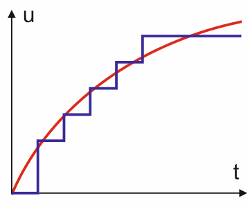

# GPIO : General Purpose Input/Output

- 마이크로 컨트롤러의 핀을 입력 또는 출력 용도로 사용할 수 있게 하는 기능
- 아두이노의 기준 전압인 5V를 이용해 출력시 0V, 5V을 선택해 출력을 내고, 입력시 핀으로 오는 전압이 0V, 5V인지 판별할 수 있다

## digitalWrite()

```arduino
digitalWrite(pinNumber, output);
digitalWrite(1, HIGH);
digitalWrite(10, LOW);
```

- GPIO의 출력을 수행.
- 첫번째 인자는 핀번호를 의미, 두번째 인자는 출력값을 의미한다
- HIGH를 입력하면 5V, LOW를 입력하면 0V를 출력한다
- HIGH와 LOW는 1과 0으로 대체가 가능하다

## digitalRead()

```arduino
digitalRead(pinNumber);
digitalRead(10);
```

- GPIO의 입력값을 받음
- 인자값은 핀번호로, 해당 핀에 5V가 걸리냐 0V가 걸리냐에 다라 1 또는 0을 반환한다

# PWM : Pulse Width Modulation


이미지 출처 : [https://developer.android.com/things/sdk/pio/pwm](https://developer.android.com/things/sdk/pio/pwm)

- 펄스의 폭을 컨트롤 하는 주기 제어방법
- 출력되는 전압의 값을 한 주기(Period) 내에서 일정한 비율(duty) 동안 High를 유지하고, 나머지는 Low를 출력해 일정한 사각파의 출력을 만들어낸다
- PWM을 이용하면 0V와 5V 사이의 아날로그 값을 모사할 수도 있으며, 제어 및 통신에서 많이 사용된다

## analogWrite()

```arduino
analogWrite(pinNumber, val);
analogWrite(6, 12);
```

- 아날로그 출력을 위해 제공하는 함수
- 첫번째 인자는 핀번호, 두번째 인자는 출력값으로 0~255까지의 정수가 들어갈 수 있다
- 출력값의 0~255까지의 값으로 duty가 0~100%로 변하게 된다

# ADC : Analog to Digital Converter


이미지 출처 : http://mypractic.com/lesson-13-analog-inputs-of-the-arduino-board-reading-analog-signals-measurement-of-the-average-value-of-the-signal/
- 아날로그 신호(0~5V 사이의 전압)를 디지털 값으로 반환해 주는 기능
- 세세한 제어가 필요한 부분에서 가변 저항을 이용해 사용한다

## analogRead()

```arduino
analogRead(pinNumber);
analogRead(10);
```

- 아날로그 입력을 디지털로 반환해주는 함수
- 반환되는 값은 0~1023의 정수값으로, 0~5V전압의 사이값에 해당한다

# UART : Universal Asynchronous Receiver/Transmitter

- 통신규격중 하나로, 아두이노의 시리얼 통신으로 더 잘 알려져 있다
- Rx(데이터 수신), Tx(데이터 송신), GND가 서로 연결되어야 하며, 비동기 통신이기 때문에 둘 간의 baud rate를 일치시켜주어야 한다

> Serial(UART)의 실제 사용은 이전에 학습한 내용에 있으므로 링크만 해둠
> [디지털 기본 제어 및 시리얼](./디지털_기본_및_시리얼_2020-09-22.md)
---

- 출처 : [https://opentutorials.org/module/2106](https://opentutorials.org/module/2106)