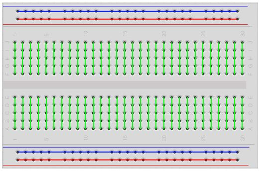
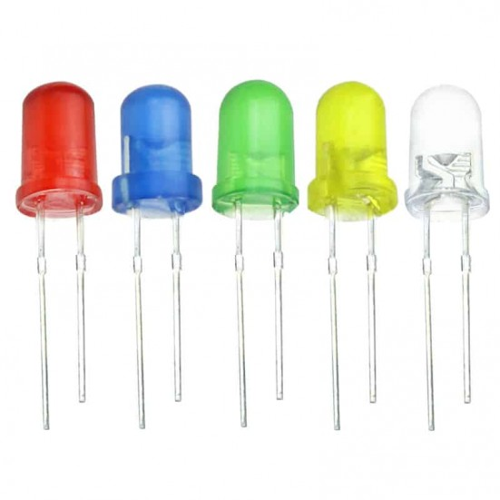
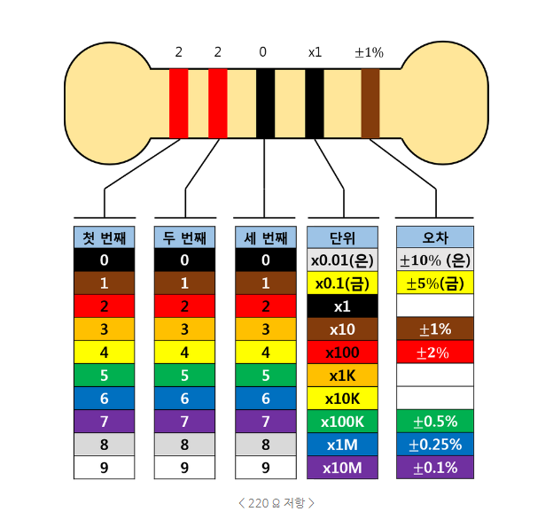
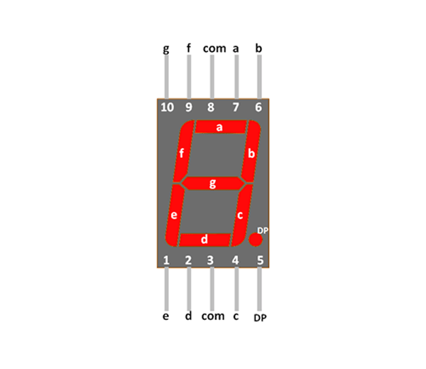
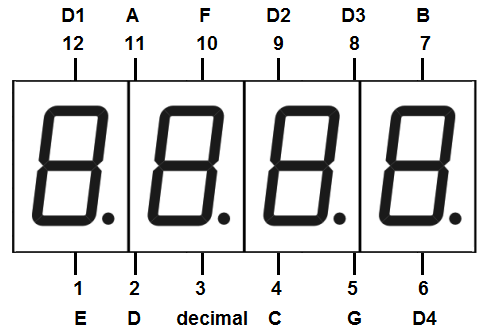
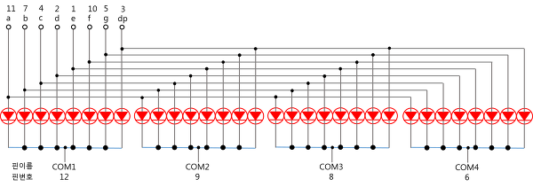
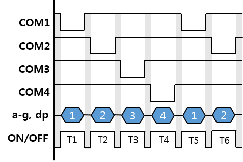

> 코드 : [FND + Serial](./fnd+serial.ino)
---
---
# 디지털 I/O

```arduino
(void) pinMode(pin, mode);         // 핀 할당
(void) digitalWrite(pin, value);   // OUTPUT(HIGH, LOW)
(int)(HIGH/LOW) digitalRead(pin);  // INPUT
```
- pin - 핀번호
- mode - 모드, INPUT, OUTPUT
- value - HIGH(1, 5V), LOW(0, 0V)

# 브레드보드



- 위, 아래쪽은 가로로 중간은 세로로 서로 전력이 연결되어있어서 주의가 필요하다

# LED

- 긴 쪽이 + 극, 짧은 쪽이 - 극 이다

# 저항

- 저항 방향은 선이 미세하게 더 굵은 쪽이 첫번쨰
- 1~3번째는 번호, 4번째는 단위, 5번째는 오차율이다

# 7-segment


- 숫자를 표현하는 데 사용되는 제품
- 내부에 LED가 8개(4-Digit는 x4), 공통단자가 들어있어 9개 핀으로 0부터 9까지, 소수점까지 표현이 가능하다
- 4-Digit는 LED핀 8개, 각각의 공통단자 4개가 들어있어 12개 핀으로 0부터 9999까지와 소수점까지 표현이 가능하다

# 공통 양극, 공통 음극

> 4-digit 규격의 공통 음극(Common Cathod)방식

- 7-segment는 공통 양극(Common Anode), 공통 음극(Common Cathode)을 구분해서 사용해야 한다.
- 공통 양극의 경우, 공통단자에 vcc(5v)를, LED핀에 gnd(0v)를 연결하면 불이 켜진다
- 제조사마다 상황이 다르므로, 공통 양극인지 음극인지 확인 후에 사용해야 한다

> 출처 : [https://kogun.tistory.com/18](https://kogun.tistory.com/18)

# 4-digit의 동적 디스플레이 제어

> 동적 디스플레이 제어를 위한 각 핀들의 타이밍 차트

- 4-digit에 4개의 다른 숫자를 표시하려면 동적 디스플레이 제어가 필요하다
- a-g,dp에 원하는 신호를 인가하고, 공통 단자인 COM1~4중 한 핀만 보이도록 신호를 인가하고 나머지는 보이지 않도록 신호를 인가하는 것이다
- 이 방식으로 COM1~4까지 동일한 방법으로 하나의 핀만 보이도록 한다
- 이 방식을 이용할 경우, 이전 시간에서 출력된 신호가 다음 시간에 영향을 미쳐 원하지 않는 조각이 흐릿하게 보이게되는 잔상이생길수 있다
- 이 잔상효과를 없애기 위해서 충분한 off 시간이 필요한데, 너무 짧은 경우 잔상 효과가 나타날 수 있고, 너무 길면 시분할 디스플레이가 눈에 보이게 되어 원하는 동적 디스플레이를 할 수 없게 된다.
- 잔상효과의 조절 때문에 제어가 어려운 단점이 있지만, 전력 소모가 적다는 장점이 있다
- 이 방식으로 인해 착시현상으로 사람이 보기에는 4개의 숫자가 디스플레이 되는 것 처럼 보이게 된다. 실제로는 빠르게 4개의 숫자가 번갈아가면서 출력되고 있다.

> 출처 : [https://kogun.tistory.com/18](https://kogun.tistory.com/18)

# Serial

- 아두이노 보드와 컴퓨터(또는 다른 장치) 사이에 통신할 때 쓰임
- RX : 수신 / TX : 송신
- 다른 보드와  핀으로 연결할 경우, 자신의 RX는 상대방의 TX로, 자신의 TX는 상대방의 RX로 연결하고, 그라운드끼리 연결한다.

## 시리얼 초기화 및 출력 - begin

```arduino
Serial.begin(115200); // 시리얼 초기화, 속도 설정
```

- begin : 초기화 및 속도 설정, 시리얼을 사용하기 위해 지정해야하는 함수

## write와 print

```arduino
Serial.write('H');
Serial.write("Hello");
Serial.println();
Serial.println("Serial Test");
```

- write와 print 둘 다 데이터를 내보내는 함수이다
- 문자나 문자열을 보낼 때는 둘의 사용처에 큰 차이가 없다
- Serial.println()을 사용하면, 출력 후 개행까지 자동으로 한다. 입력이 없으면 개행만 한다

```arduino
Serial.print(45); -> 45
Serial.write(45); -> -
```

- 단, 숫자를 보낼 때는 차이점이 발생한다
- Serial.print(45)는 45를 4와 5에 해당하는 아스키코드인 52,53으로 바꾸어 시리얼에 전송한다. 그리고 시리얼 모니터는 들어온 데이터를 아스키코드로 생각하기 때문에 이를 다시 본래 문자인 4와 5로 바꾸어 출력한다
- Serial.write(45)는 이를 변환하지 않고 그냥 45라는 값을 내보낸다. 마찬가지로 시리얼 모니터는 45라는 값을 아스키코드로 생각해 '-'라는 문자로 바꾸어 출력한다

## 시리얼 입력

```arduino
Serial.available();
// 시리얼 버퍼에 있는 데이터의 길이를 반환

Serial.read();
// 시리얼 버퍼에 있는 가장 앞 1바이트를 읽어옴. 유효데이터가 없는 경우 -1을 반환
```

- Serial.available() : 시리얼 버퍼에 있는 데이터의 길이를 반환, 이를 이용해 시리얼 버퍼에 내용이 있는지 확인할 수 있다.
- write나 print, 시리얼 모니터에 입력 등으로 인해 들어온 데이터는 시리얼 버퍼에 저장된다. 이를 read로 읽어옴으로써 데이터 수신이 이뤄지게 된다
- Serial.read() : 시리얼 버퍼에 있는 데이터의 가장 맨 앞 1바이트를 읽어온다.
- 정식 홈페이지 레퍼런스를 보면 리턴값의 타입이 int로 되어있다.
- 그런데, 반환값을 int로 받고 이 값을 write로 출력하면 정상적으로 문자가 출력된다! (위에서 서숧한대로 print를 이용하면 값이 다르게 출력된다)
- 즉, 리턴값의 타입인 int는 아스키코드의 값을 의미한다